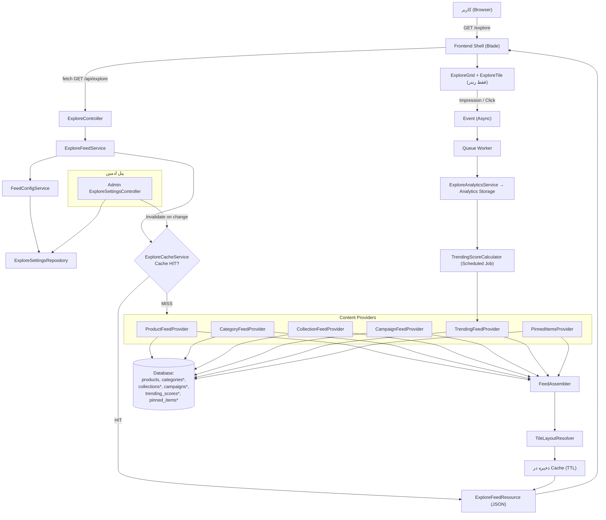

# معماری سیستم Explore — فاز ۱ (Architecture Only)

> بدون کد، بدون Migration، بدون Controller. فقط معماری. این سند قبل از شروع فاز ۲ (دیتابیس) باید توسط کاربر تایید شود.
> این سند بر پایه‌ی کدبیس فعلی پروژه (`vatan-ai`) نوشته شده: جدول `products` موجود است (فیلدهای `category`/`subcategory` به‌صورت string ساده، بدون جدول جدا)، روت فعلی `/explore` فقط یک View استاتیک است (`app.ideas`)، `CACHE_STORE=database`، `QUEUE_CONNECTION=database`، و الگوی `app/Services` + `app/Jobs` از قبل در پروژه جا افتاده (`OpenRouterService`, `ProcessImageJob`).

---

## ۱. معماری سطح‌بالا (High-Level Architecture)

جریان کامل از لحظه‌ی باز شدن صفحه Explore تا نمایش محتوا:

```
کاربر (Browser)
   ↓  GET /explore  (بار اول — Blade Shell خالی، بدون داده)
Frontend Shell (Blade + JS سبک)
   ↓  fetch  GET /api/explore?page=1&segment=guest
API Layer  (ExploreController)
   ↓
Explore Feed Service   ← Feed Config Service (نسبت‌ها/تنظیمات ادمین)
   ↓
Cache Layer  (cache-aside: ابتدا کش چک می‌شود)
   │
   ├── HIT  → مستقیم برگرد به API Layer
   │
   └── MISS
        ↓
   Content Providers (Product / Category / Collection / Campaign / Trending / Featured / Sponsored / Banner)
        ↓
   Feed Assembler  (ترکیب طبق نسبت + Pinned Items + Tile Layout)
        ↓
   ذخیره در Cache (با TTL)
        ↓
   برگرد به API Layer
   ↓
API Resource (JSON استاندارد + متادیتای صفحه‌بندی)
   ↓
Frontend  (فقط رندر — Grid + Tile + Skeleton + Infinite Scroll)
   ↓
تعامل کاربر (Impression / Click / Scroll)
   ↓
Analytics Event  (async، از طریق Queue)
   ↓
Analytics Storage  → تغذیه‌ی Trending Score و (در آینده) Recommendation Engine
```

نکته‌ی کلیدی: **Frontend هیچ منطقی ندارد.** فقط چیزی را که Feed Assembler تصمیم گرفته (چه آیتمی، با چه اندازه‌ی Tile، با چه ترتیبی) رندر می‌کند. تمام تصمیم‌گیری در Layer 2 (بک‌اند) است.

---

## ۲. تفکیک کامپوننت‌ها (Component Breakdown)

### ۲.۱ لایه API

| کامپوننت | مسئولیت | ورودی | خروجی | وابستگی |
|---|---|---|---|---|
| `ExploreController` | دریافت Request، اعتبارسنجی پارامترها (page, per_page, segment)، صدا زدن Service، برگرداندن Resource | HTTP Request | `ExploreFeedResource` (JSON) | `ExploreFeedService` |
| `ExploreFeedResource` (API Resource) | فرمت یکنواخت خروجی برای همه‌ی انواع Tile | نتیجه‌ی خام Feed | JSON استاندارد (شامل `type`, `tile_size`, `data`) | — |

### ۲.۲ لایه Feed Generation (قلب سیستم)

| کامپوننت | مسئولیت | ورودی | خروجی | وابستگی |
|---|---|---|---|---|
| `ExploreFeedService` | ارکستریشن کلی: چک کش → صدا زدن Providerها طبق نسبت → صدا زدن Assembler → ذخیره کش | پارامترهای صفحه/سگمنت کاربر | آرایه‌ی نهایی Feed | `ExploreCacheService`, `FeedConfigService`, همه‌ی Providerها, `FeedAssembler` |
| `FeedConfigService` | خواندن تنظیمات فعلی ادمین (نسبت درصدی هر نوع محتوا، سطح Randomness، اندازه Tileها) از دیتابیس/کش تنظیمات | — | آبجکت Config | `ExploreSettingsRepository` |
| `ProductFeedProvider` | واکشی محصولات مناسب فید (فعال، طبق فیلتر تازگی/محبوبیت) | معیارهای فیلتر + تعداد لازم | لیست محصولات خام | `Product` model |
| `CategoryFeedProvider` | واکشی دسته‌بندی‌های پیشنهادی | تعداد لازم | لیست دسته‌ها | جدول `categories` (فاز ۲) |
| `CollectionFeedProvider` | واکشی مجموعه‌های ویژه | تعداد لازم | لیست کالکشن‌ها | جدول `collections` (فاز ۲) |
| `CampaignFeedProvider` | واکشی کمپین‌های فعال (بر اساس بازه‌ی زمانی) | تعداد لازم | لیست کمپین‌ها | جدول `campaigns` (فاز ۲) |
| `TrendingFeedProvider` | واکشی آیتم‌های ترند بر اساس Trending Score محاسبه‌شده | تعداد لازم | لیست آیتم‌های ترند | جدول `trending_scores` (فاز ۲) |
| `PinnedItemsProvider` | واکشی آیتم‌های Pin شده‌ی ادمین که باید در موقعیت ثابت ظاهر شوند | — | لیست آیتم + موقعیت اجباری | جدول `explore_pinned_items` (فاز ۲) |
| `FeedAssembler` | ترکیب خروجی همه‌ی Providerها طبق نسبت Config + تزریق Pinned در موقعیت ثابت + تعیین اندازه‌ی Tile هر آیتم | خروجی همه‌ی Providerها + Config | آرایه‌ی نهایی و مرتب‌شده‌ی Feed | `TileLayoutResolver` |
| `TileLayoutResolver` | تصمیم‌گیری اندازه‌ی Tile (1×1 / 1×2 / 2×1 / 2×2) برای هر آیتم طبق نوع محتوا و تنظیمات ادمین | نوع آیتم + Config | اندازه‌ی Tile | — |

### ۲.۳ لایه کش

| کامپوننت | مسئولیت | ورودی | خروجی | وابستگی |
|---|---|---|---|---|
| `ExploreCacheService` | خواندن/نوشتن/Invalidate کردن کش فید با کلید ترکیبی (segment + page + config-version) | کلید کش | Feed کش‌شده یا null | Laravel Cache (فعلاً driver=`database`؛ پیشنهاد فاز بعد: Redis) |

### ۲.۴ لایه آنالیتیکس

| کامپوننت | مسئولیت | ورودی | خروجی | وابستگی |
|---|---|---|---|---|
| `ExploreAnalyticsService` | ثبت رویدادهای Impression/Click/Scroll به‌صورت async | Event | نوشتن در جدول آنالیتیکس (فاز ۲) | Queue |
| `TrendingScoreCalculator` (Job زمان‌بندی‌شده) | محاسبه‌ی دوره‌ای امتیاز ترند بر اساس کلیک/بازدید/تازگی | داده‌ی خام آنالیتیکس | به‌روزرسانی `trending_scores` | Queue, Scheduler |

### ۲.۵ لایه ادمین

| کامپوننت | مسئولیت | ورودی | خروجی | وابستگی |
|---|---|---|---|---|
| `Admin\ExploreSettingsController` | فرم مدیریت نسبت فید، Pinned Items، کمپین‌ها، Randomness | ورودی فرم ادمین | ذخیره در `ExploreSettingsRepository` + Invalidate کش فید | `FeedConfigService` |

### ۲.۶ لایه Frontend (فقط نمایش)

| کامپوننت | مسئولیت |
|---|---|
| `ExploreGrid` | چیدمان CSS Grid، بدون تصمیم‌گیری محتوا |
| `ExploreTile` | رندر یک آیتم طبق `type` و `tile_size` دریافتی از API |
| `Skeleton Loading` | نمایش حالت لودینگ قبل از پاسخ API |
| `Infinite Scroll Handler` | فقط صدا زدن صفحه‌ی بعدی API، بدون منطق ترتیب/فیلتر |

---

## ۳. جریان داده (Data Flow)

```
[دیتابیس]
   products, categories*, collections*, campaigns*, trending_scores*, explore_pinned_items*
        ↓ (Eloquent + Query Scopes)
[Content Providers]
   هرکدام فقط مسئول نوع خودشان — کوئری بهینه با ایندکس روی status/is_featured/is_trending/created_at
        ↓
[FeedAssembler]
   ترکیب طبق درصد Config  (مثال: محصول ۵۰٪, دسته ۱۵٪, کالکشن ۱۰٪, ترند ۱۰٪, ویژه ۵٪, اسپانسر ۵٪, کمپین ۵٪)
   + تزریق Pinned Items در موقعیت ثابت
   + تعیین Tile Size هرکدام
        ↓
[ExploreCacheService]
   ذخیره‌ی نتیجه با TTL کوتاه (مثلاً ۵-۱۵ دقیقه) + کلید شامل نسخه‌ی Config
        ↓
[API Resource → JSON]
   { type, tile_size, data, meta: { page, has_more } }
        ↓
[Frontend]
   رندر Grid → کاربر اسکرول/کلیک می‌کند
        ↓
[Analytics Event (Impression/Click)]  — ارسال async، بدون کند کردن UX
        ↓ (Queue Job)
[Analytics Storage]
        ↓ (Job زمان‌بندی‌شده — مثلاً هر ساعت)
[TrendingScoreCalculator]
   امتیاز جدید محاسبه و در trending_scores ذخیره می‌شود
        ↓ (چرخه‌ی بازخورد)
   دفعه‌ی بعد که TrendingFeedProvider صدا زده شود، امتیاز جدید را می‌بیند
```

نکته‌ی مهم: مسیر آنالیتیکس هرگز مسیر اصلی درخواست کاربر را کند نمی‌کند — رویداد صرفاً Dispatch می‌شود و پردازش واقعی در Queue Worker انجام می‌شود.

*جداول ستاره‌دار (`categories`, `collections`, `campaigns`, `trending_scores`, `explore_pinned_items`) هنوز در دیتابیس وجود ندارند — طراحی آن‌ها موضوع فاز ۲ است.

---

## ۴. چرخه حیات فید Explore (Feed Lifecycle)

| سوال | پاسخ معماری |
|---|---|
| فید چطور ساخته می‌شود؟ | اولین درخواست هر ترکیب (segment + page) باعث MISS شدن کش می‌شود → `ExploreFeedService` آن را از صفر می‌سازد و کش می‌کند |
| چه زمانی بازتولید می‌شود؟ | (الف) انقضای TTL کش، (ب) رویداد Invalidation دستی/خودکار |
| کش کِی Invalidate می‌شود؟ | با هر تغییر مؤثر: ادمین تنظیمات نسبت را عوض کند، محصولی Pin/Unpin شود، کمپینی فعال/غیرفعال شود، محصول جدیدی Active شود — هرکدام Event اختصاصی خودشان را Fire می‌کنند که به یک Listener مشترک (`InvalidateExploreCache`) می‌رسد |
| محصولات جدید چطور وارد فید می‌شوند؟ | با فعال‌شدن محصول (Observer روی مدل `Product`)، فید در چرخه‌ی بعدی regenerate آن را (طبق امتیاز تازگی/فیلتر Config) لحاظ می‌کند؛ نیازی به رفرش فوری همه‌ی کش‌ها نیست، چون TTL کوتاه است |
| کمپین‌ها چطور وارد می‌شوند؟ | ادمین کمپین را با `start_at`/`end_at` ثبت می‌کند؛ یک Scheduled Command هر چند دقیقه کمپین‌های در بازه را Activate و کش مرتبط را Invalidate می‌کند |
| Pinned Items چطور وارد می‌شوند؟ | مستقل از منطق نسبت‌بندی — در `FeedAssembler` همیشه در موقعیت ثابت (مثلاً جایگاه ۱ و ۵) درج می‌شوند، صرف‌نظر از الگوریتم امتیازدهی |

---

## ۵. مقیاس‌پذیری (Scalability)

### Service Layer
تمام منطق در `app/Services` (الگویی که در پروژه از قبل با `OpenRouterService` جا افتاده) — Controller فقط نازک و بدون منطق تجاری. این باعث می‌شود منطق فید مستقل از HTTP قابل تست باشد و بعداً قابل استفاده در Job/Command هم باشد.

### Cache Layer
وضعیت فعلی: `CACHE_STORE=database` — برای محیط توسعه مناسب است اما زیر بار سنگین (میلیون‌ها درخواست) کارایی کافی ندارد چون هر خواندن/نوشتن کش یک Query روی MySQL است.
پیشنهاد: انتقال به **Redis** (در `.env` پروژه از قبل متغیرهای `REDIS_HOST`/`REDIS_PORT` تعریف شده‌اند، فقط باید فعال/تنظیم شوند). مزیت: کش با Tag (`Cache::tags(['explore'])`) برای Invalidation انتخابی، و سرعت بسیار بالاتر برای فیدی که هر چند دقیقه بازتولید می‌شود.

### Queue Layer
وضعیت فعلی: `QUEUE_CONNECTION=database` — الگوی Job در پروژه با `ProcessImageJob` جا افتاده.
پیشنهاد برای مقیاس: انتقال Queue به Redis (یا در آینده Horizon برای مانیتورینگ)، تا کارهای سنگین (محاسبه‌ی Trending Score، Aggregation آنالیتیکس، Regeneration دوره‌ای فید) بدون بلاک کردن Web Worker اجرا شوند.

### Future Recommendation Engine
منطق رتبه‌بندی فعلی (Rule-based: ترکیب نسبت‌های ثابت + Trending Score ساده) پشت یک Interface مشترک (`RankingEngineInterface`) قرار می‌گیرد. جایگزینی با موتور یادگیری ماشین در آینده فقط به معنای پیاده‌سازی یک Implementation جدید از همان Interface است — بدون تغییر در Controller، API Contract یا Frontend.

### Future AI Layer
سیگنال‌های شخصی‌سازی (کلیک، جستجو، خرید، ساعت بازدید) در جدول‌های آنالیتیکس ذخیره می‌شوند اما امروز در تصمیم‌گیری فید استفاده نمی‌شوند — صرفاً جمع‌آوری می‌شوند تا وقتی موتور AI آماده شد، داده‌ی تاریخی از قبل موجود باشد.

---

## ۶. ساختار پوشه‌ها (Folder Structure)

بدون نوشتن کد — فقط چیدمان پوشه‌ها. طراحی طوری است که با ساختار فعلی پروژه (`app/Services`, `app/Jobs` مسطح، بدون پوشه‌بندی Domain-Driven) هم‌خوان بماند، نه اینکه یک الگوی کاملاً جدید و ناآشنا تحمیل کند.

```
app/
├── Services/
│   ├── OpenRouterService.php        (موجود — بدون تغییر)
│   ├── LogService.php               (موجود — بدون تغییر)
│   └── Explore/
│       ├── ExploreFeedService.php       ← ارکستریتور اصلی فید
│       ├── FeedConfigService.php        ← خواندن تنظیمات ادمین
│       ├── ExploreCacheService.php      ← cache-aside + invalidation
│       ├── ExploreAnalyticsService.php  ← ثبت رویدادها
│       └── Providers/
│           ├── ProductFeedProvider.php
│           ├── CategoryFeedProvider.php
│           ├── CollectionFeedProvider.php
│           ├── CampaignFeedProvider.php
│           ├── TrendingFeedProvider.php
│           └── PinnedItemsProvider.php
│
├── Repositories/
│   ├── ExploreSettingsRepository.php
│   ├── PinnedItemsRepository.php
│   └── TrendingScoreRepository.php
│
├── DTOs/
│   ├── ExploreFeedItemDTO.php
│   └── FeedConfigDTO.php
│
├── Actions/
│   └── Explore/
│       ├── BuildExploreFeedAction.php
│       ├── InvalidateExploreCacheAction.php
│       └── RecalculateTrendingScoreAction.php
│
├── Policies/
│   └── ExploreSettingsPolicy.php
│
├── Enums/
│   ├── ExploreContentType.php   (product/category/collection/campaign/trending/...)
│   ├── TileSize.php             (1x1/1x2/2x1/2x2)
│   └── FeedSegment.php          (guest/registered/...)
│
├── Jobs/
│   ├── ProcessImageJob.php              (موجود — بدون تغییر)
│   ├── RegenerateExploreFeedJob.php
│   ├── RecalculateTrendingScoresJob.php
│   └── AggregateExploreAnalyticsJob.php
│
├── Events/
│   ├── ProductViewed.php
│   ├── ProductClicked.php
│   └── ExploreCacheShouldInvalidate.php
│
├── Listeners/
│   ├── RecordExploreAnalytics.php
│   └── InvalidateExploreCacheListener.php
│
├── Models/
│   ├── Product.php               (موجود — بدون تغییر)
│   ├── Category.php               (جدید، فاز ۲)
│   ├── Collection.php             (جدید، فاز ۲)
│   ├── Campaign.php               (جدید، فاز ۲)
│   ├── TrendingScore.php          (جدید، فاز ۲)
│   └── ExplorePinnedItem.php      (جدید، فاز ۲)
│
└── Http/
    ├── Controllers/
    │   ├── ExploreController.php
    │   └── Admin/ExploreSettingsController.php
    └── Resources/
        ├── ExploreFeedResource.php
        └── ExploreTileResource.php
```

**چرا این چیدمان:**

- `Services/Explore/` به‌جای پخش‌شدن فایل‌ها در ریشه‌ی `Services/` — چون تعداد کلاس‌های Explore زیاد است، اما همچنان زیرمجموعه‌ی همان پوشه‌ی آشنای `app/Services` می‌ماند (نه یک ساختار Domain-Driven کاملاً جدید که تیم باید از صفر یاد بگیرد).
- `Repositories/` و `DTOs/` و `Actions/` و `Enums/` پوشه‌های استاندارد اکوسیستم لاراول هستند (الگوی رایج Spatie/Laravel Actions) — Controller را نازک نگه می‌دارند و منطق را قابل تست مستقل می‌کنند.
- `Policies/ExploreSettingsPolicy` از همین الان اضافه شده تا وقتی نقش‌های ادمین (مدیر محتوا در مقابل مدیر کامل) دقیق‌تر شد، مجوزدهی آماده باشد.
- `Jobs/` و `Events/Listeners/` جدا نگه داشته شده‌اند چون مسیر آنالیتیکس و Invalidation کش باید async و decoupled از مسیر اصلی Request باشند.

---

## ۷. ریسک‌های معماری (Risks)

| ریسک | توضیح | راه‌حل پیشنهادی |
|---|---|---|
| `CACHE_STORE=database` زیر بار سنگین | هر خواندن/نوشتن کش یک Query روی MySQL است؛ با میلیون‌ها Request همزمان، جدول `cache` و کل دیتابیس گلوگاه می‌شود | مهاجرت به Redis قبل از لانچ عمومی (متغیرهای `REDIS_*` در `.env` از قبل آماده‌اند) |
| `QUEUE_CONNECTION=database` زیر بار سنگین | Jobهای سنگین (محاسبه‌ی Trending، Aggregation آنالیتیکس) روی همان جدول MySQL صف می‌شوند و رقابت با ترافیک اصلی ایجاد می‌کنند | مهاجرت Queue به Redis (و در آینده Horizon برای مانیتورینگ) |
| نبود جدول مجزا برای Category/Collection | فعلاً `category`/`subcategory` فقط ستون رشته‌ای روی `products` هستند — نمی‌شود برای هر دسته تصویر، ترتیب، توضیح یا صفحه‌ی اختصاصی تعریف کرد | ساخت جدول `categories`/`collections` در فاز ۲ به‌جای رشته‌ی آزاد |
| Cache Stampede | اگر چند Request همزمان با کش MISS مواجه شوند، ممکن است چند نمونه هم‌زمان فید یکسان را دوباره بسازند و فشار غیرضروری روی دیتابیس بگذارند | استفاده از `Cache::lock()` دور فرآیند ساخت فید تا فقط یک Request مسئول بازسازی باشد |
| رشد انفجاری کلید کش در صورت شخصی‌سازی زودهنگام | اگر فید per-user (نه per-segment) کش شود، تعداد کلیدهای کش با تعداد کاربران خطی رشد می‌کند | کش را روی سطح Segment نگه دارید (guest/عمومی)؛ شخصی‌سازی واقعی وقتی AI Layer اضافه شد، لایه‌ی جدا و سبک‌تری می‌گیرد (نه cache-per-user) |
| تداخل Pinned Items با نسبت‌های Config | اگر تعداد آیتم‌های Pin‌شده زیاد شود، می‌تواند عملاً نسبت‌های تعریف‌شده (مثلاً محصول ۵۰٪) را بی‌معنا کند | تعریف سقف حداکثر Pinned Items در هر صفحه از فید |
| وابستگی Campaign به دقت Scheduler | فعال/غیرفعال شدن کمپین به دقت اجرای Cron سرور وابسته است؛ تاخیر چند دقیقه‌ای ممکن است رخ دهد | برای MVP قابل قبول است؛ در آینده می‌توان event-driven‌تر کرد (مثلاً صف با تاخیر دقیق `delay()`) |
| Trending Score دوره‌ای، نه Real-time | نوسانات لحظه‌ای محبوبیت بلافاصله در فید دیده نمی‌شود | تصمیم آگاهانه برای کاهش بار پردازشی؛ در صورت نیاز بعداً می‌توان بازه‌ی محاسبه را کوتاه‌تر کرد |

---

## ۸. دیاگرام معماری (Mermaid)



---

## ۹. نقشه راه پیاده‌سازی (Implementation Roadmap)

هر آیتم تقریباً معادل یک جلسه‌ی توسعه است. ترتیب پیشنهادی برای فاز ۲ به بعد:

| # | جلسه | خروجی |
|---|---|---|
| ۱ | طراحی و ساخت Migrationهای دیتابیس | جدول‌های `categories`, `collections`, `campaigns`, `trending_scores`, `explore_pinned_items`, `explore_settings`, `explore_analytics_events` |
| ۲ | مدل‌های Eloquent + روابط + Seederهای نمونه | `Category`, `Collection`, `Campaign`, `TrendingScore`, `ExplorePinnedItem` + factories |
| ۳ | `ExploreSettingsRepository` + `FeedConfigService` | خواندن/نوشتن تنظیمات نسبت فید (بک‌اند فقط، بدون UI) |
| ۴ | Content Providerهای پایه | `ProductFeedProvider`, `CategoryFeedProvider`, `CollectionFeedProvider` |
| ۵ | Content Providerهای پیشرفته | `CampaignFeedProvider`, `TrendingFeedProvider`, `PinnedItemsProvider` |
| ۶ | `FeedAssembler` + `TileLayoutResolver` + `ExploreFeedService` | منطق ترکیب و ارکستریشن کامل فید (بدون کش هنوز) |
| ۷ | `ExploreCacheService` + Eventهای Invalidation | کش cache-aside + گوش‌دادن به تغییرات محصول/کمپین/Pin |
| ۸ | لایه API | `ExploreController`, `ExploreFeedResource`, صفحه‌بندی/Infinite Scroll Contract |
| ۹ | Frontend — Grid/Tile/Skeleton/Infinite Scroll | کامپوننت‌های فقط-نمایشی طبق Contract فوق |
| ۱۰ | پنل مدیریت Explore در ادمین | تنظیم نسبت فید، Pinned Items، مدیریت کمپین (UI) |
| ۱۱ | آنالیتیکس — Eventها/Listenerها/Queue Jobs | ثبت Impression/Click به‌صورت async |
| ۱۲ | `TrendingScoreCalculator` + Scheduler | محاسبه‌ی دوره‌ای امتیاز ترند و اتصال به `TrendingFeedProvider` |
| ۱۳ | مهاجرت Cache/Queue به Redis | آماده‌سازی برای بار تولیدی واقعی |
| ۱۴ | تست بار (Load Testing) + بهینه‌سازی نهایی | QA و آماده‌سازی برای لانچ |

---

## جمع‌بندی وضعیت

هر ۹ بخش فاز ۱ (معماری سطح‌بالا، تفکیک کامپوننت‌ها، جریان داده، چرخه حیات فید، مقیاس‌پذیری، ساختار پوشه‌ها، ریسک‌ها، دیاگرام Mermaid، نقشه راه پیاده‌سازی) تکمیل شد. طبق دستور فاز ۱، هیچ کدی نوشته نشد — این سند صرفاً معماری و برنامه‌ریزی است و فاز ۲ (طراحی دیتابیس) منوط به تایید همین سند است.
