# موتور فید (Feed Engine) — فاز ۲: طراحی کامل دیتابیس و مدل داده

> بدون Migration، بدون SQL، بدون کد. فقط معماری و مدل داده. این سند ادامه‌ی مستقیم `Explore Architecture Phase 1.md` است و باید قبل از شروع فاز ۳ (پیاده‌سازی واقعی در لاراول) تایید شود.

---

## ۰. دو اصل حاکم بر کل این سند (طبق درخواست صریح کاربر)

### اصل ۱ — این یک «موتور فید عمومی» است، نه یک سیستم اختصاصی Explore

قرار نیست چیزی به اسم «فقط برای Explore» ساخته شود. تمام جداول، امتیازدهی، چیدمان و کش این سند حول مفهوم **Surface (بستر نمایش)** طراحی شده‌اند. Explore، Home و Trends هرکدام یک `Surface` هستند که از **همان** جداول، **همان** سیستم امتیازدهی و **همان** موتور Assembly استفاده می‌کنند — فقط تنظیمات (نسبت‌ها، وزن‌ها، قوانین چیدمان) per-surface فرق دارد. نتیجه: وقتی فردا خواستی همین موتور را زیر صفحه‌ی «هوم» یا «ترندز» بگذاری، هیچ جدول یا Service جدیدی لازم نیست — فقط یک ردیف جدید در `feed_surfaces` و یک `feed_settings` مخصوص همان Surface.

### اصل ۲ — پارتیشن‌بندی کامل: هم در ادمین، هم در دیتابیس

**در دیتابیس:** تمام جداول جدید این سند با پیشوند `feed_` نام‌گذاری می‌شوند (نه `explore_` — دقیقاً چون موتور عمومی است). **هیچ ستون یا رابطه‌ی جدیدی به جداول موجود پروژه (`products`, `users`, `generations`, ...) اضافه نمی‌شود.** ارتباط با آن‌ها فقط از طریق جداول Polymorphic/Pivot جدید برقرار می‌شود. یعنی Migrationهای این بخش صد‌درصد Additive هستند و هیچ جدول موجودی را ALTER نمی‌کنند؛ ریسک به‌هم‌ریختن بخش‌های دیگر پنل عملاً صفر است.

**در پنل ادمین:** یک منوی سطح‌بالای جدید در سایدبار با عنوان **«اکسپلور»** اضافه می‌شود (دقیقاً هم‌سطح و هم‌الگو با منوهای موجود مثل «محصولات» و «مدل‌های هوشمند» — با `toggleSub`)، با زیرمنوی اول **«مدیریت اکسپلور»** (و در آینده می‌توان زیرمنوهای «مدیریت هوم»/«مدیریت ترندز» را هم به همین منو یا منوی مشابه اضافه کرد، چون همگی از یک موتور تغذیه می‌شوند). Route Group کاملاً مجزا: `admin.explore.*` → `/admin/explore/*`. Controllerها زیر namespace اختصاصی `App\Http\Controllers\Admin\Explore\*`، Viewها زیر `resources/views/admin/explore/*` با پارشیال‌های اختصاصی خودشان.

> نکته‌ی مهم درباره‌ی مرز «مجزا بودن»: طبق قانون غیرقابل‌مذاکره‌ی پروژه (`CLAUDE.md` بند ۳)، پارشیال‌های سراسری `header.blade.php` / `mini-sidebar.blade.php` / `sidebar.blade.php` همچنان در این بخش هم include می‌شوند — چون این‌ها زیرساخت مشترک کل پنل هستند، نه چیزی که «مدیریت اکسپلور» باید از آن جدا شود. مجزا بودن یعنی: هیچ Controller/View/Migration این بخش به فایل‌های بخش‌های دیگر (محصولات، سفارشات، کاربران، تنظیمات) دست نمی‌زند، و برعکس — نه اینکه هدر/سایدبار مشترک را دوباره از صفر بسازیم.

این دو اصل پایه‌ی تمام طراحی زیر است.

---

## ۱. جداول موجود و نحوه‌ی استفاده‌ی مجدد

بر خلاف فرض اولیه‌ی بریف (که فرض کرده بود Categories/Collections/Tags/Favorites/Search History/Purchases/Ratings/Views از قبل وجود دارند)، بررسی کدبیس واقعی پروژه نشان داد این وضعیت فعلی است:

| جدول | وضعیت واقعی در کدبیس | نقش در موتور فید | فیلدهای لازم برای اتصال |
|---|---|---|---|
| `products` | **موجود و کامل** (`Product` model) | مهم‌ترین منبع محتوای فید؛ هر محصول یک Feed Content Item بالقوه است | `id`, `status` (فیلتر فقط active), `is_featured`, `is_new`, `is_trending`, `created_at` (برای Freshness Score), `category`/`subcategory` (رشته‌ای فعلی) |
| `users` | **موجود** | صاحب Session/Interaction/Preference در بخش شخصی‌سازی | `id` |
| `generations` | **موجود** (خروجی تولید AI کاربران) | منبع بالقوه برای «محبوب‌ترین تولیدشده‌ها»/UGC در آینده — در فاز ۲ فقط رابطه‌اش دیده می‌شود، مصرف نمی‌شود | `id`, `product_id`, `created_at` |
| `plans` | موجود | بی‌ربط مستقیم به فید، فقط برای فیلتر احتمالی «محصولات ویژه‌ی اشتراک X» در آینده | — |
| `ai_models` | موجود | بی‌ربط مستقیم به فید | — |
| `categories` | **وجود ندارد** — فعلاً فقط ستون رشته‌ای `products.category`/`products.subcategory` | باید به‌عنوان جدول مستقل ساخته شود (بخش ۲) تا قابل مدیریت از ادمین (تصویر/ترتیب/توضیح) باشد | — |
| `collections`, `tags` (جدول مجزا), `favorites`, `search_history`, `purchases`, `product_ratings`, `product_views` | **هیچ‌کدام وجود ندارند** | همه در بخش ۲ به‌عنوان جدول جدید طراحی می‌شوند | — |

**نتیجه‌گیری گام ۱:** تنها جدول واقعاً «موجود و آماده‌ی استفاده‌ی مستقیم» برای فید، `products` است. بقیه‌ی مفاهیم بریف (Categories, Collections, Favorites, ...) باید از صفر و به‌صورت جداول جدید طراحی شوند — و همان‌طور که در اصل ۱ گفته شد، طوری طراحی می‌شوند که مختص Explore نباشند.

---

## ۲. جداول جدید موتور فید (Feed Engine Tables)

### ۲.۱ هسته‌ی موتور (Surface & Settings)

**`feed_surfaces`** — تعریف هر «بستر نمایش» (Explore/Home/Trending/...)
| ستون | نوع | توضیح |
|---|---|---|
| `id` | bigint PK | — |
| `key` | string, unique | `explore`, `home`, `trending`, ... |
| `title_fa` | string | عنوان نمایشی در ادمین |
| `is_active` | boolean | — |
| `created_at/updated_at` | timestamp | — |

ایندکس: unique روی `key`.

**`feed_settings`** — تنظیمات هر Surface (نسخه‌دار، برای Rollback و A/B)
| ستون | نوع | توضیح |
|---|---|---|
| `id` | bigint PK | — |
| `feed_surface_id` | FK → `feed_surfaces.id` | — |
| `content_ratios` | json | `{"product":50,"category":15,"collection":10,"trending":10,"featured":5,"sponsored":5,"campaign":5}` |
| `randomness_level` | tinyint (0-100) | میزان تصادفی‌بودن ترتیب داخل هر بازه‌ی امتیاز مساوی |
| `ranking_weights` | json | وزن هر فاکتور امتیازدهی (بخش ۵) |
| `cache_ttl_seconds` | integer | — |
| `is_active_version` | boolean | فقط یک نسخه‌ی فعال per surface |
| `created_by` (admin_id) | FK → `admins.id` | — |
| `created_at` | timestamp | — |

رابطه: `feed_surface` 1—N `feed_settings` (تاریخچه‌ی نسخه‌ها)، ولی فقط یکی `is_active_version=true`.

### ۲.۲ دسته‌بندی و مجموعه (که فعلاً وجود ندارند)

**`categories`**
| ستون | نوع | توضیح |
|---|---|---|
| `id` | PK | — |
| `parent_id` | FK nullable → `categories.id` | برای زیردسته (self-reference) |
| `name_fa`, `name_en` | string | — |
| `slug` | string unique | — |
| `icon`, `cover_image` | string nullable | — |
| `sort_order` | integer | — |
| `is_active` | boolean | — |

ایندکس: `parent_id`, `slug` (unique).

**`collections`**
| ستون | نوع | توضیح |
|---|---|---|
| `id` | PK | — |
| `title_fa`, `title_en` | string | — |
| `slug` | string unique | — |
| `description` | text nullable | — |
| `cover_image` | string | — |
| `is_active` | boolean | — |
| `sort_order` | integer | — |

**`collection_items`** (Pivot چندریختی — یک کالکشن می‌تواند محصول/دسته/... داشته باشد)
| ستون | نوع | توضیح |
|---|---|---|
| `id` | PK | — |
| `collection_id` | FK → `collections.id` | — |
| `feed_content_item_id` | FK → `feed_content_items.id` | به‌جای اشاره‌ی مستقیم به `products`، به لایه‌ی عمومی وصل می‌شود (بخش ۴) |
| `sort_order` | integer | — |

### ۲.۳ محتوای جامع فید (شرح کامل در بخش ۴)

**`feed_content_items`** — نقطه‌ی اتصال عمومی همه‌ی انواع محتوا
| ستون | نوع | توضیح |
|---|---|---|
| `id` | PK | — |
| `content_type` | string | discriminator: `product`, `category`, `collection`, `campaign`, `editorial`, `banner`, `educational`, `sponsored`, `seasonal` |
| `content_id` | bigint nullable | برای انواعی که جدول اختصاصی دارند (اشاره به `products.id` و ...)؛ Polymorphic |
| `payload` | json nullable | برای انواع «Self-contained» بدون جدول اختصاصی (بنر/ادیتوریال/آموزشی) — عنوان/تصویر/لینک/متن مستقیم اینجا |
| `is_active` | boolean | — |
| `created_at` | timestamp | برای Freshness Score |

ایندکس: composite `(content_type, content_id)`, `is_active`.

### ۲.۴ کمپین و زمان‌بندی

**`feed_campaigns`**
| ستون | نوع | توضیح |
|---|---|---|
| `id` | PK | — |
| `title_fa` | string | — |
| `type` | string | `promotional`, `seasonal`, `sponsored` |
| `weight` | decimal | ورودی مستقیم Ranking (بخش ۵) |
| `region_scope` | json nullable | مثلاً `["IR"]` یا `null` = همه‌جا |
| `feed_schedule_id` | FK → `feed_schedules.id` | — |
| `is_active` | boolean | — |

**`feed_campaign_items`** (Pivot — کمپین به چند آیتم فید وصل می‌شود)
| ستون | نوع | توضیح |
|---|---|---|
| `feed_campaign_id` | FK | — |
| `feed_content_item_id` | FK → `feed_content_items.id` | — |
| `sort_order` | integer | — |

**`feed_schedules`** — جدول عمومی زمان‌بندی (نه مخصوص کمپین؛ Pinned Item و Seasonal Event هم از همین استفاده می‌کنند)
| ستون | نوع | توضیح |
|---|---|---|
| `id` | PK | — |
| `schedulable_type` | string | Polymorphic discriminator: `campaign`, `pinned_item`, `seasonal_event` |
| `schedulable_id` | bigint | — |
| `start_at` | datetime | — |
| `end_at` | datetime nullable | `null` = بدون انقضا |
| `priority` | tinyint | برای تعارض بین چند زمان‌بندی هم‌زمان |
| `time_window` | json nullable | مثلاً فقط ساعت ۹ تا ۲۳ |
| `recurrence_rule` | string nullable | برای رویدادهای فصلی تکرارشونده (نوروز/یلدا هرسال) — فرمت شبیه cron ساده‌شده |
| `auto_expire` | boolean | — |

ایندکس: composite `(schedulable_type, schedulable_id)`, `start_at`, `end_at` (برای Query سریع «چی الان فعاله»).

### ۲.۵ سنجاق‌شده‌ها (Pinned)

**`feed_pinned_items`**
| ستون | نوع | توضیح |
|---|---|---|
| `id` | PK | — |
| `feed_surface_id` | FK | کدام Surface (Explore/Home/...) |
| `feed_content_item_id` | FK | — |
| `position` | integer | موقعیت ثابت در فید (۱، ۵، ...) |
| `feed_schedule_id` | FK nullable | برای Pin موقت با تاریخ انقضا |

### ۲.۶ چیدمان (شرح کامل بخش ۶)

**`feed_layout_templates`**
| ستون | نوع | توضیح |
|---|---|---|
| `id` | PK | — |
| `content_type` | string | برای کدام نوع محتوا |
| `feed_surface_id` | FK nullable | `null` = پیش‌فرض همه‌ی Surfaceها |
| `allowed_tile_sizes` | json | `["1x1","2x1"]` |
| `default_tile_size` | string | — |
| `render_variant` | string | `static`, `carousel`, `video`, `animated` |

### ۲.۷ امتیازدهی (شرح کامل بخش ۵)

**`feed_content_scores`**
| ستون | نوع | توضیح |
|---|---|---|
| `id` | PK | — |
| `feed_content_item_id` | FK | — |
| `feed_surface_id` | FK | امتیاز per-surface متفاوت است |
| `popularity_score`, `freshness_score`, `ctr_score`, `conversion_score`, `trending_score`, `recommendation_score`, `ai_score` | decimal | فاکتورهای خام |
| `admin_priority`, `campaign_weight`, `manual_boost` | decimal | فاکتورهای دستی/ادمین |
| `final_score` | decimal | خروجی نهایی (Weighted Sum طبق `feed_settings.ranking_weights`) |
| `computed_at` | timestamp | — |

ایندکس: composite `(feed_surface_id, final_score DESC)` — مهم‌ترین ایندکس کل سیستم، مستقیماً روی مسیر داغ Query می‌نشیند.

### ۲.۸ آزمایش A/B

**`feed_experiments`**
| ستون | نوع | توضیح |
|---|---|---|
| `id` | PK | — |
| `feed_surface_id` | FK | — |
| `name` | string | — |
| `status` | enum | draft/running/completed |
| `start_at`, `end_at` | datetime | — |

**`feed_experiment_variants`**
| ستون | نوع | توضیح |
|---|---|---|
| `id` | PK | — |
| `feed_experiment_id` | FK | — |
| `variant_key` | string | `A`, `B`, ... |
| `feed_settings_id` | FK | هر Variant به یک نسخه‌ی `feed_settings` وصل می‌شود |
| `traffic_percentage` | tinyint | — |

**`feed_experiment_assignments`**
| ستون | نوع | توضیح |
|---|---|---|
| `id` | PK | — |
| `feed_experiment_id` | FK | — |
| `feed_experiment_variant_id` | FK | — |
| `user_id` nullable / `session_token` | — | برای Guest هم پشتیبانی شود |
| `assigned_at` | timestamp | — |

ایندکس: composite `(feed_experiment_id, user_id)` unique تا هر کاربر همیشه همان Variant را ببیند.

### ۲.۹ کش (فقط Metadata — خود Payload در Redis می‌ماند)

**`feed_snapshots`**
| ستون | نوع | توضیح |
|---|---|---|
| `id` | PK | — |
| `feed_surface_id` | FK | — |
| `cache_key` | string | کلید متناظر در Redis |
| `segment` | string | `guest`, `registered`, ... |
| `generated_at` | timestamp | — |
| `expires_at` | timestamp | — |
| `item_count` | integer | برای Debug سریع در ادمین بدون باز کردن Redis |

> این جدول خودِ Payload فید را ذخیره نمی‌کند (آن در Redis زندگی می‌کند) — فقط برای دیده‌شدن وضعیت کش در پنل ادمین («آخرین بار کِی فید ساخته شد؟») و Debugging است.

### ۲.۱۰ آنالیتیکس (شرح کامل بخش ۸)

**`feed_sessions`**, **`feed_events`**, **`feed_tile_performance`** — در بخش ۸ به‌طور کامل توضیح داده شده‌اند.

### ۲.۱۱ شخصی‌سازی (شرح کامل بخش ۹)

**`user_feed_preferences`**, **`user_content_interactions`**, **`user_recommendation_feedback`**, **`user_recently_viewed`**, **`recommendation_scores`** — در بخش ۹.

---

## ۳. روابط (Relationships)

| نوع رابطه | مثال در این طراحی |
|---|---|
| **One-to-Many** | `feed_surfaces` → `feed_settings` (هر Surface چند نسخه تنظیمات در طول زمان دارد) |
| **One-to-Many** | `feed_campaigns` → `feed_campaign_items` |
| **One-to-Many** | `feed_content_items` → `feed_content_scores` (per surface) |
| **Many-to-Many (با Pivot صریح)** | `collections` ↔ `feed_content_items` از طریق `collection_items` |
| **Many-to-Many (با Pivot صریح)** | `feed_campaigns` ↔ `feed_content_items` از طریق `feed_campaign_items` |
| **Polymorphic (Morph To)** | `feed_content_items.content_type/content_id` → `Product`, `Category`, `Collection`, ... (فقط برای انواعی که مدل اختصاصی دارند) |
| **Polymorphic (Morph To)** | `feed_schedules.schedulable_type/schedulable_id` → `feed_campaigns`, `feed_pinned_items`, `seasonal_events` |
| **Self-Reference (سلسله‌مراتبی، شبه Inheritance)** | `categories.parent_id` → `categories.id` برای زیردسته |
| **Discriminator-based Type (به‌جای Inheritance واقعی)** | `feed_content_items.content_type` + ستون `payload` جایگزین Single Table Inheritance برای انواع بدون جدول اختصاصی (بنر/ادیتوریال/آموزشی) |
| **One-to-One (per Assignment)** | `feed_experiment_assignments` هر کاربر دقیقاً به یک Variant در هر Experiment |

نکته‌ی معماری کلیدی: **هیچ جدول Pivot یا Pinned/Campaign مستقیماً به `products` اشاره نمی‌کند.** همه از طریق `feed_content_items` عبور می‌کنند. این یعنی وقتی فردا یک نوع محتوای کاملاً جدید (مثلاً «ویدیوی کوتاه») اضافه شد، فقط کافیست یک ردیف جدید در `feed_content_items` با `content_type=video` بسازی — بدون تغییر در `feed_pinned_items`, `feed_campaign_items`, `collection_items`, `feed_content_scores`.

---

## ۴. مدل جامع آیتم فید (Universal Feed Item Model)

هدف: فید نباید مستقیماً به `products` وابسته باشد. راه‌حل: **لایه‌ی انتزاعی `feed_content_items`** (شرح در ۲.۳) که دو حالت دارد:

1. **محتوای دارای جدول اختصاصی** (`content_type=product|category|collection|campaign`) → `content_id` به همان جدول واقعی اشاره می‌کند (Polymorphic واقعی، شبیه Laravel `morphTo`).
2. **محتوای Self-contained بدون جدول اختصاصی** (`content_type=banner|editorial|educational|seasonal`) → `content_id = null`، و تمام داده (عنوان، تصویر، لینک، متن) در ستون `payload` (JSON) ذخیره می‌شود. این از ساخت ۵-۶ جدول کوچک و کم‌استفاده (مثلاً `banners`, `educational_cards`) جلوگیری می‌کند و در عین حال کاملاً مدیریت‌پذیر از ادمین است.

هر نوع محتوای جدید در آینده (مثلاً «پیشنهاد AI» یا «کارت ویدیویی») فقط یک مقدار جدید برای `content_type` است — نه یک جدول جدید، مگر اینکه آن نوع محتوا واقعاً نیاز به فیلدهای رابطه‌ای پیچیده داشته باشد (مثل Campaign که زمان‌بندی و وزن دارد).

این لایه، دقیقاً همان چیزی است که در فاز ۱ به‌عنوان «Frontend فقط رندر می‌کند، تصمیم در بک‌اند است» توضیح داده شد — اینجا نسخه‌ی دیتابیسی همان اصل است: هر آیتمی که در فید ظاهر می‌شود، صرف‌نظر از نوع واقعی‌اش، از یک نقطه‌ی واحد (`feed_content_items`) عبور کرده است.

---

## ۵. سیستم امتیازدهی (Ranking System)

هر آیتم (`feed_content_item`) به ازای هر Surface یک ردیف در `feed_content_scores` دارد با فاکتورهای زیر:

| فاکتور | منبع محاسبه | به‌روزرسانی |
|---|---|---|
| `popularity_score` | تعداد Impression/Click تجمعی (از `feed_tile_performance`) | دوره‌ای (Job) |
| `freshness_score` | فاصله‌ی زمانی از `created_at` محتوا (تابع نزولی، نه Boolean) | در لحظه‌ی محاسبه (نیازی به ذخیره‌ی جدا ندارد، اما برای سرعت Cache می‌شود) |
| `ctr_score` | Click / Impression از `feed_tile_performance` | دوره‌ای |
| `conversion_score` | نرخ تبدیل (کلیک → مصرف Credit/خرید) | دوره‌ای |
| `trending_score` | شیب رشد تعامل در بازه‌ی کوتاه (مثلاً ۲۴ ساعت اخیر در مقابل میانگین) | دوره‌ای (Job جدا، بازه‌ی کوتاه‌تر از بقیه) |
| `recommendation_score` | خروجی موتور پیشنهاد (فعلاً Rule-based ساده، در آینده AI) | دوره‌ای/per-user (بخش ۹) |
| `admin_priority` | مقدار دستی ادمین (۰ تا ۱۰۰) | فوری با ذخیره‌ی ادمین |
| `campaign_weight` | از `feed_campaigns.weight` اگر آیتم بخشی از یک کمپین فعال باشد | با فعال/غیرفعال شدن کمپین |
| `manual_boost` | Boost موقت دستی ادمین با تاریخ انقضا (از طریق همان `feed_schedules`) | فوری |
| `ai_score` | Placeholder برای فاز‌های بعدی AI — امروز همیشه ۰ یا null | — |

**فرمول نهایی:** `final_score = Σ (factor_i × weight_i)` که وزن‌ها (`weight_i`) در `feed_settings.ranking_weights` **per-surface** تعریف می‌شوند — یعنی همان محصول می‌تواند در «هوم» وزن تازگی بالاتر و در «ترندز» وزن Trending بسیار بالاتر داشته باشد، بدون هیچ تغییر در داده‌ی خام محصول.

محاسبه Real-time نیست (طبق ریسک‌های فاز ۱) — یک Job زمان‌بندی‌شده (`RecalculateContentScoresJob`) دوره‌ای (مثلاً هر ۱۵-۳۰ دقیقه برای اکثر فاکتورها، و بازه‌ی کوتاه‌تر مثلاً هر ۵ دقیقه فقط برای `trending_score`) این جدول را به‌روز می‌کند.

---

## ۶. سیستم چیدمان (Layout)

اطلاعات چیدمان در دو سطح ذخیره می‌شود:

1. **قوانین (Rules) — سطح تنظیمات:** جدول `feed_layout_templates` (بخش ۲.۶) مشخص می‌کند هر `content_type` در هر `feed_surface` چه اندازه‌های Tile مجازی دارد (`allowed_tile_sizes`) و چه Variant رندری (`render_variant`: static/carousel/video/animated). این‌ها توسط ادمین قابل تغییرند.
2. **تخصیص واقعی (Assignment) — سطح Runtime:** اندازه‌ی Tile که واقعاً به هر آیتم در یک درخواست خاص داده می‌شود، در لحظه‌ی Feed Assembly (فاز ۱، `TileLayoutResolver`) تصمیم‌گیری و در `feed_snapshots`/Cache Payload ذخیره می‌شود — **نه در دیتابیس اصلی**، چون این تخصیص per-request و گذرا است، نه یک ویژگی دائمی محتوا.

این تفکیک باعث می‌شود اضافه‌شدن یک Layout جدید در آینده (مثلاً «کارت ویدیویی عمودی») فقط نیازمند یک ردیف جدید در `feed_layout_templates` باشد، بدون تغییر Schema.

---

## ۷. زمان‌بندی (Scheduling)

جدول عمومی `feed_schedules` (بخش ۲.۴) توسط سه موجودیت مختلف به‌صورت Polymorphic استفاده می‌شود: کمپین‌ها، Pinned Items، و رویدادهای فصلی (`seasonal_event` — که خودش می‌تواند صرفاً یک `feed_content_item` با `content_type=seasonal` باشد که به یک `feed_schedule` وصل است، بدون نیاز به جدول جدا).

پشتیبانی از تمام موارد خواسته‌شده:
- `start_at` / `end_at`: بازه‌ی فعال بودن.
- `priority`: وقتی دو زمان‌بندی هم‌زمان روی یک Slot تعارض دارند (مثلاً دو کمپین که هر دو می‌خواهند موقعیت Pin شماره ۱ را بگیرند)، `priority` بالاتر برنده است.
- `time_window` (JSON): بازه‌ی ساعتی در روز (مثلاً کمپین فقط ساعت ۹ تا ۲۳).
- `region_scope` (روی خود `feed_campaigns`، نه `feed_schedules`، چون منطقه ویژگی محتواست نه زمان): محدودسازی جغرافیایی.
- `recurrence_rule`: برای رویدادهای فصلی تکرارشونده سالانه (نوروز، یلدا) — یک رشته‌ی ساده‌ی قابل‌تفسیر (نه cron کامل چون نیاز واقعی این سطح از پیچیدگی نیست).
- `auto_expire`: اگر `true`، وقتی `end_at` بگذرد، محتوا خودکار از `is_active` فید خارج می‌شود (توسط یک Job دوره‌ای، نه Trigger دیتابیسی — سازگار با معماری Laravel Scheduler).

---

## ۸. داده‌های آنالیتیکس

به‌جای ساخت جدول جداگانه برای هر نوع رویداد (Impression/Click/Hover/Save/Share/...) — که باعث تکثیر جدول و پیچیدگی Query در Join می‌شود — طراحی پیشنهادی یک جدول **رویداد عمومی** با `event_type` است (تصمیم آگاهانه، توضیح کامل در بخش ۱۲):

**`feed_sessions`**
| ستون | نوع | توضیح |
|---|---|---|
| `id` | PK | — |
| `session_token` | string, unique | شامل کاربران مهمان هم می‌شود |
| `user_id` | FK nullable → `users.id` | — |
| `feed_surface_id` | FK | — |
| `device_type` | string | mobile/desktop |
| `started_at`, `ended_at` | timestamp | برای Session Duration |

**`feed_events`** (جدول عمومی همه‌ی تعاملات)
| ستون | نوع | توضیح |
|---|---|---|
| `id` | bigint PK | — |
| `feed_session_id` | FK | — |
| `feed_content_item_id` | FK nullable | برای رویدادهایی مثل `scroll_depth` که به آیتم خاصی مرتبط نیستند، null |
| `event_type` | enum/string | `impression`, `click`, `hover`, `save`, `share`, `open_product`, `conversion`, `exit`, `scroll_depth` |
| `position_in_feed` | integer nullable | — |
| `tile_size` | string nullable | برای تحلیل «کدام اندازه‌ی Tile بهتر عمل می‌کند» |
| `metadata` | json nullable | مقدار اضافی مخصوص هر `event_type` (مثلاً درصد Scroll، مقصد Share) |
| `created_at` | timestamp | — |

ایندکس: composite `(feed_content_item_id, event_type, created_at)`، composite `(feed_session_id, created_at)`. این جدول **Append-Only** و پرحجم‌ترین جدول کل سیستم است — استراتژی Partitioning و Archiving آن در بخش ۱۰ توضیح داده شده.

**`feed_tile_performance`** (Rollup روزانه — برای سرعت داشبورد آنالیتیکس ادمین، به‌جای Aggregate زنده روی میلیون‌ها ردیف `feed_events`)
| ستون | نوع | توضیح |
|---|---|---|
| `id` | PK | — |
| `feed_content_item_id` | FK | — |
| `feed_surface_id` | FK | — |
| `date` | date | — |
| `impressions`, `clicks`, `saves`, `shares`, `conversions` | integer | شمارش روزانه |
| `ctr` | decimal | محاسبه‌شده |
| `avg_scroll_depth` | decimal | — |

ایندکس: composite unique `(feed_content_item_id, feed_surface_id, date)`. عملکرد Category/Campaign هم از همین جدول با یک `JOIN`/فیلتر روی `content_type` استخراج می‌شود — نیازی به جدول جدای `feed_category_performance`/`feed_campaign_performance` نیست (ساده‌سازی، شرح در بخش ۱۲).

یک Job دوره‌ای (`AggregateFeedTilePerformanceJob`) هر شب، `feed_events` روز قبل را می‌خواند و در `feed_tile_performance` Rollup می‌کند.

---

## ۹. داده‌های شخصی‌سازی (Personalization)

**`user_feed_preferences`**
| ستون | نوع | توضیح |
|---|---|---|
| `id` | PK | — |
| `user_id` | FK | — |
| `favorite_category_ids` | json | آرایه‌ای از `categories.id` |
| `hidden_category_ids` | json | دسته‌هایی که کاربر گفته «نشونم نده» |
| `updated_at` | timestamp | — |

**`user_content_interactions`** (امتیاز تعامل تجمعی هر کاربر با هر آیتم — برای Recommendation ساده امروز، ورودی AI فردا)
| ستون | نوع | توضیح |
|---|---|---|
| `id` | PK | — |
| `user_id` | FK | — |
| `feed_content_item_id` | FK | — |
| `view_count`, `click_count` | integer | — |
| `affinity_score` | decimal | امتیاز ترکیبی، دوره‌ای محاسبه می‌شود |
| `last_interacted_at` | timestamp | — |

ایندکس: composite unique `(user_id, feed_content_item_id)`.

**`user_recommendation_feedback`** (بازخورد صریح — نه فقط ضمنی)
| ستون | نوع | توضیح |
|---|---|---|
| `id` | PK | — |
| `user_id` | FK | — |
| `feed_content_item_id` | FK | — |
| `feedback_type` | enum | `not_interested`, `hide_forever`, `liked` |
| `created_at` | timestamp | — |

**`user_recently_viewed`** (لیست کوتاه و محدود، نه تاریخچه‌ی کامل — آن در `feed_events` هست)
| ستون | نوع | توضیح |
|---|---|---|
| `user_id` | FK | — |
| `feed_content_item_id` | FK | — |
| `viewed_at` | timestamp | — |

Constraint منطقی (نه دیتابیسی سخت): نگه‌داشتن فقط N ردیف آخر per user (مثلاً ۵۰ تا) — با یک Job پاک‌سازی دوره‌ای، نه Trigger.

**`recommendation_scores`** (خروجی موتور پیشنهاد آینده — امروز خالی/Rule-based ساده)
| ستون | نوع | توضیح |
|---|---|---|
| `id` | PK | — |
| `user_id` | FK | — |
| `feed_content_item_id` | FK | — |
| `score` | decimal | — |
| `model_version` | string | برای مقایسه‌ی نسخه‌های مختلف مدل در آینده (A/B مدل) |
| `embedding_ref` | string nullable | **نه خودِ Embedding** — فقط یک شناسه/اشاره به Vector Store خارجی (Pinecone/pgvector/...) که در فاز‌های AI آینده اضافه می‌شود؛ ذخیره‌ی مستقیم بردار در MySQL توصیه نمی‌شود |
| `computed_at` | timestamp | — |

این ۵ جدول دقیقاً همان چیزی هستند که موتور Rule-based امروز نیاز ندارد استفاده کند، اما وجودشان یعنی وقتی AI Layer آماده شد، داده‌ی تاریخی کافی از قبل جمع شده — دقیقاً طبق اصل «Future-proof بدون پیاده‌سازی زودهنگام» که در فاز ۱ (بخش AI Personalization) تعریف شد.

---

## ۱۰. کارایی و مقیاس‌پذیری (Performance)

| موضوع | توصیه |
|---|---|
| **ایندکس‌های حیاتی** | `feed_content_scores(feed_surface_id, final_score DESC)` (مسیر داغ رتبه‌بندی)، `feed_content_items(content_type, content_id)`، `feed_events(feed_content_item_id, event_type, created_at)`، `feed_schedules(schedulable_type, schedulable_id)`، `feed_schedules(start_at, end_at)` |
| **Partitioning** | `feed_events` به‌دلیل حجم بسیار بالا باید بر اساس `created_at` (ماهانه) Partition شود؛ جداول Rollup (`feed_tile_performance`) نیازی به Partition ندارند چون حجمشان چند مرتبه کوچک‌تر است |
| **استراتژی کش** | خودِ Payload فید (خروجی نهایی Assembly) در **Redis** می‌ماند (نه در جدول)؛ MySQL فقط منبع حقیقت (Source of Truth) و Metadata کش (`feed_snapshots`) را نگه می‌دارد؛ کش per-surface + per-segment، نه per-user (طبق ریسک فاز ۱) |
| **Read Replica** | Queryهای سنگین آنالیتیکس/ادمین (گزارش‌های Tile Performance، Dashboard) باید از یک Read Replica جدا بخوانند تا با مسیر داغ نوشتن Impression/Click رقابت نکنند |
| **سازگاری Redis** | هم برای Cache Layer (فاز ۱) و هم به‌عنوان گزینه‌ی Queue Driver آینده — پروژه از قبل متغیرهای `REDIS_*` را در `.env` دارد، فقط نیاز به فعال‌سازی |
| **پشتیبانی Queue** | تمام Jobهای سنگین (`RecalculateContentScoresJob`, `AggregateFeedTilePerformanceJob`, Cache Invalidation) باید Async و از طریق Queue اجرا شوند، نه Sync در مسیر Request |
| **Archiving / Cold Storage** | ردیف‌های `feed_events` قدیمی‌تر از مثلاً ۹۰ روز به یک جدول/Storage سرد (یا فایل Parquet/S3-compatible در آینده) منتقل شوند؛ داده‌ی Rollup (`feed_tile_performance`) برای همیشه نگه داشته می‌شود چون سبک است |
| **بهینه‌سازی کلی** | مسیر خواندن فید هرگز نباید مستقیماً روی `feed_events` (جدول خام پرحجم) Query بزند — همیشه از `feed_content_scores`/`feed_tile_performance` (جداول از‌پیش‌محاسبه‌شده) می‌خواند؛ این جداسازی Write-path (رویدادهای خام) از Read-path (امتیاز/Rollup آماده) کلیدی‌ترین تصمیم مقیاس‌پذیری کل این سند است |

---

## ۱۱. دیاگرام ERD کامل (Mermaid)

```mermaid
erDiagram
    FEED_SURFACES ||--o{ FEED_SETTINGS : "has versions"
    FEED_SURFACES ||--o{ FEED_PINNED_ITEMS : "per surface"
    FEED_SURFACES ||--o{ FEED_CONTENT_SCORES : "per surface"
    FEED_SURFACES ||--o{ FEED_LAYOUT_TEMPLATES : "optional override"
    FEED_SURFACES ||--o{ FEED_EXPERIMENTS : "runs"
    FEED_SURFACES ||--o{ FEED_SESSIONS : "tracked in"
    FEED_SURFACES ||--o{ FEED_SNAPSHOTS : "cached per"

    FEED_CONTENT_ITEMS }o--|| PRODUCTS : "morphTo (content_type=product)"
    FEED_CONTENT_ITEMS }o--|| CATEGORIES : "morphTo (content_type=category)"
    FEED_CONTENT_ITEMS }o--|| COLLECTIONS : "morphTo (content_type=collection)"
    FEED_CONTENT_ITEMS }o--|| FEED_CAMPAIGNS : "morphTo (content_type=campaign)"

    CATEGORIES ||--o{ CATEGORIES : "parent_id (self)"

    COLLECTIONS ||--o{ COLLECTION_ITEMS : "has"
    COLLECTION_ITEMS }o--|| FEED_CONTENT_ITEMS : "points to"

    FEED_CAMPAIGNS ||--o{ FEED_CAMPAIGN_ITEMS : "has"
    FEED_CAMPAIGN_ITEMS }o--|| FEED_CONTENT_ITEMS : "points to"
    FEED_CAMPAIGNS ||--|| FEED_SCHEDULES : "scheduled by (morph)"

    FEED_PINNED_ITEMS }o--|| FEED_CONTENT_ITEMS : "pins"
    FEED_PINNED_ITEMS ||--o| FEED_SCHEDULES : "optional schedule (morph)"

    FEED_CONTENT_ITEMS ||--o{ FEED_CONTENT_SCORES : "scored per surface"
    FEED_CONTENT_ITEMS ||--o{ FEED_TILE_PERFORMANCE : "rolled up daily"
    FEED_CONTENT_ITEMS ||--o{ FEED_EVENTS : "referenced by"
    FEED_CONTENT_ITEMS ||--o{ USER_CONTENT_INTERACTIONS : "interacted"
    FEED_CONTENT_ITEMS ||--o{ USER_RECOMMENDATION_FEEDBACK : "feedback on"
    FEED_CONTENT_ITEMS ||--o{ USER_RECENTLY_VIEWED : "viewed"
    FEED_CONTENT_ITEMS ||--o{ RECOMMENDATION_SCORES : "scored for user"
    FEED_CONTENT_ITEMS ||--o{ COLLECTION_ITEMS : "belongs to collections"

    FEED_SESSIONS ||--o{ FEED_EVENTS : "generates"
    FEED_SESSIONS }o--|| USERS : "optional (guest allowed)"

    FEED_EXPERIMENTS ||--o{ FEED_EXPERIMENT_VARIANTS : "has"
    FEED_EXPERIMENT_VARIANTS ||--|| FEED_SETTINGS : "uses config"
    FEED_EXPERIMENT_VARIANTS ||--o{ FEED_EXPERIMENT_ASSIGNMENTS : "assigned to users"
    FEED_EXPERIMENT_ASSIGNMENTS }o--|| USERS : "optional (guest allowed)"

    USERS ||--o{ USER_FEED_PREFERENCES : "has"
    USERS ||--o{ USER_CONTENT_INTERACTIONS : "has"
    USERS ||--o{ USER_RECOMMENDATION_FEEDBACK : "gives"
    USERS ||--o{ USER_RECENTLY_VIEWED : "has"
    USERS ||--o{ RECOMMENDATION_SCORES : "receives"

    FEED_SCHEDULES ||--o{ FEED_CAMPAIGNS : "schedules (morph)"
    FEED_SCHEDULES ||--o{ FEED_PINNED_ITEMS : "schedules (morph)"
```

---

## ۱۲. بازبینی نهایی (Final Review)

### نقاط ضعف بالقوه شناسایی‌شده

- **`feed_content_items` می‌تواند تبدیل به Bottleneck شود** چون هر Query مربوط به فید از این جدول عبور می‌کند. راه‌حل پیش‌بینی‌شده: هیچ‌وقت مستقیم روی این جدول Filter سنگین (مثل Full-text Search) انجام نشود — جستجو باید روی جداول واقعی (`products`) انجام و فقط نتیجه‌ی نهایی از `feed_content_items` Join شود.
- **JSON columns (`payload`, `content_ratios`, `ranking_weights`, `metadata`)** انعطاف می‌دهند اما غیرقابل‌ایندکس مستقیم هستند. این یک Trade-off آگاهانه است: سرعت توسعه/انعطاف در برابر امکان Query پیچیده روی محتوای JSON. برای این پروژه (که تعداد Content Type محدود و شناخته‌شده است) این معامله منطقی است.

### جداول غیرضروری که آگاهانه حذف شدند

- جداول جداگانه‌ی `banners`, `educational_cards`, `editorial_cards` → در `feed_content_items.payload` ادغام شدند (بخش ۴).
- جداول جداگانه‌ی `feed_impressions`, `feed_clicks`, `feed_scroll_events`, `feed_hover_events` → همه در یک جدول عمومی `feed_events` با `event_type` ادغام شدند (بخش ۸). این هم حجم Migration را کم می‌کند، هم Query تحلیلی («تمام تعاملات یک Session») را به یک Query ساده تبدیل می‌کند به‌جای ۵ Join.
- جداول جداگانه‌ی `feed_category_performance`/`feed_campaign_performance` → از همان `feed_tile_performance` با فیلتر روی `content_type` استخراج می‌شوند.

### پیشنهادهای سطح Enterprise (نگاه Staff Engineer)

- در مقیاس واقعاً میلیونی، مسیر نوشتن `feed_events` بهتر است از نوشتن مستقیم روی MySQL به یک **Event Stream** (Redis Streams یا Kafka) تغییر کند؛ Consumerها به‌صورت Batch در `feed_tile_performance` می‌نویسند. طراحی فعلی (`feed_events` مستقیم روی MySQL) برای مقیاس اولیه تا صدها هزار کاربر کاملاً کافی است و می‌تواند بعداً بدون تغییر Schema به این مدل مهاجرت کند (چون Consumer نهایی همان `feed_tile_performance` است).
- برای A/B Testing، اگر تعداد Experimentها و پیچیدگی زیاد شد، به‌جای نگه‌داشتن `feed_experiments`/`feed_experiment_variants` دستی، می‌توان از یک ابزار تخصصی Feature-Flag/Experimentation (مثل GrowthBook) استفاده کرد که فقط `variant_key` نهایی را به این موتور پاس می‌دهد — طراحی فعلی این تعویض را ساده نگه داشته چون `feed_experiment_assignments` مستقل از منطق تصمیم‌گیری Variant است.
- Embeddings را هرگز در MySQL ذخیره نکنید (`recommendation_scores.embedding_ref` عمداً فقط یک اشاره‌گر است) — وقتی فاز AI واقعی شروع شد، یک Vector Database اختصاصی (pgvector/Pinecone/Weaviate) کنار MySQL اضافه شود.

### جمع‌بندی

طراحی این سند بر پایه‌ی دو اصل ابتدای سند (موتور عمومی + پارتیشن‌بندی کامل) ساخته شده و آماده‌ی تایید برای شروع فاز ۳ (پیاده‌سازی واقعی Migration/Model در لاراول، شامل ساخت واقعی منوی «اکسپلور» و «مدیریت اکسپلور» در ادمین) است.
