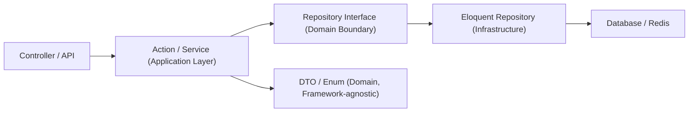
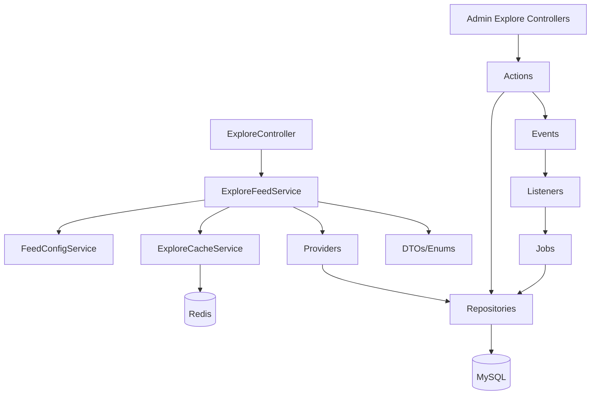
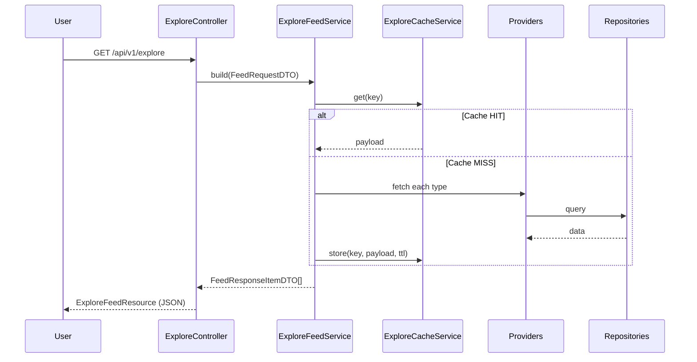
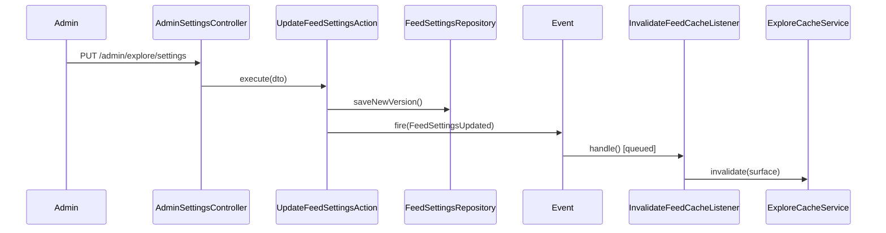

# موتور فید — فاز ۳: معماری کامل بک‌اند (بدون کد)

> ادامه‌ی مستقیم فاز ۱ (معماری) و فاز ۲ (دیتابیس). بدون کد، فقط طراحی.

**بروزرسانی بر اساس وضعیت واقعی کد:** جدول `categories` واقعی (`id, name, slug, image` + `products.category_id`) توسط امیر اضافه شده. طراحی این‌جا از همین جدول واقعی استفاده می‌کند (نه نسخه‌ی پیشنهادی غنی‌تر فاز ۲) — `CategoryRepository` مستقیم روی آن کار می‌کند و `feed_content_items` با `content_type=category, content_id=categories.id` به آن وصل می‌شود.

---

## ۱. Service Layer و ساختار پوشه نهایی

```
app/
├── Services/Explore/
│   ├── ExploreFeedService.php
│   ├── FeedConfigService.php
│   ├── ExploreCacheService.php
│   ├── ExploreAnalyticsService.php
│   ├── ContentScoreService.php
│   └── Providers/ (ProductFeedProvider, CategoryFeedProvider, CollectionFeedProvider, CampaignFeedProvider, TrendingFeedProvider, PinnedItemsProvider)
├── Repositories/
│   ├── Contracts/           ← Interfaceها
│   └── Eloquent/            ← پیاده‌سازی
├── Actions/Explore/
├── DTOs/Explore/
├── Http/
│   ├── Controllers/Api/V1/ExploreController.php
│   ├── Controllers/Admin/Explore/*  (SettingsController, CampaignController, PinnedItemController, CategoryController, CollectionController, AnalyticsController)
│   ├── Requests/Explore/
│   └── Resources/Explore/
├── Policies/Explore/
├── Enums/Explore/
├── Events/Explore/
├── Listeners/Explore/
├── Jobs/Explore/
└── Exceptions/Explore/
```

قانون: هیچ فایلی خارج از این زیرپوشه‌ها برای Explore ساخته نمی‌شود؛ Controllerهای غیر-Explore دست‌نخورده می‌مانند.

---

## ۲. Repository Pattern

هر Repository یک Interface در `Contracts/` و یک پیاده‌سازی Eloquent در `Eloquent/` دارد — تعویض بعدی (مثلاً به Elasticsearch برای جستجو) بدون تغییر Service.

| Interface | جدول | متدهای کلیدی |
|---|---|---|
| `ProductRepositoryInterface` | `products` (موجود) | `activeForFeed()`, `findFresh($since)` |
| `CategoryRepositoryInterface` | `categories` (موجود) | `active()` |
| `CollectionRepositoryInterface` | `collections` | `activeWithItems()` |
| `CampaignRepositoryInterface` | `feed_campaigns` | `activeNow()` |
| `FeedContentItemRepositoryInterface` | `feed_content_items` | `resolveMorph()`, `findOrCreateForModel()` |
| `FeedSettingsRepositoryInterface` | `feed_settings` | `activeFor($surface)`, `saveNewVersion()` |
| `FeedPinnedItemRepositoryInterface` | `feed_pinned_items` | `forSurface()` |
| `FeedScheduleRepositoryInterface` | `feed_schedules` | `activeWindow()` |
| `FeedContentScoreRepositoryInterface` | `feed_content_scores` | `topFor($surface, $limit)` |
| `FeedTilePerformanceRepositoryInterface` | `feed_tile_performance` | `rollupRange()` |
| `UserFeedPreferenceRepositoryInterface` | `user_feed_preferences` | `for($userId)` |

Binding در `ExploreServiceProvider::register()` (یک Provider جدید، مستقل، بدون تغییر Providerهای موجود).

---

## ۳. Action Classes (تک‌مسئولیتی، `execute()`)

| Action | مسئولیت |
|---|---|
| `BuildExploreFeedAction` | ارکستریشن ساخت یک صفحه از فید |
| `InvalidateFeedCacheAction` | پاک کردن کش یک Surface |
| `RecalculateContentScoresAction` | محاسبه‌ی مجدد امتیازها |
| `RecalculateTrendingScoresAction` | محاسبه‌ی مجدد فقط Trending |
| `PinContentItemAction` / `UnpinContentItemAction` | مدیریت Pin |
| `CreateCampaignAction` / `ActivateCampaignAction` / `ExpireCampaignAction` | چرخه‌ی کمپین |
| `UpdateFeedSettingsAction` | ذخیره‌ی نسخه‌ی جدید تنظیمات + Invalidate |
| `RecordFeedEventAction` | ثبت رویداد خام (Impression/Click/...) |
| `AggregateTilePerformanceAction` | Rollup روزانه |
| `AssignExperimentVariantAction` | تخصیص کاربر به Variant |

---

## ۴. DTOها

| DTO | حامل چه چیزی |
|---|---|
| `FeedRequestDTO` | surface, segment, page, per_page |
| `FeedResponseItemDTO` | content_type, tile_size, payload یکنواخت برای رندر |
| `FeedConfigDTO` | content_ratios, ranking_weights, randomness |
| `ContentScoreDTO` | تک‌تک فاکتورهای امتیاز + final_score |
| `ScheduleWindowDTO` | start_at, end_at, priority, time_window |
| `EventTrackingDTO` | event_type, content_item_id, session, metadata |

DTOها به‌جای آرایه‌ی خام بین Controller ↔ Action ↔ Service ↔ Repository رد و بدل می‌شوند (Type-safety).

---

## ۵. API Resources

| Resource | مصرف |
|---|---|
| `ExploreFeedResource` (Collection) | خروجی عمومی `GET /api/v1/explore` |
| `FeedTileResource` | هر آیتم، فرمت یکنواخت با `type`/`tile_size` |
| `Admin\FeedSettingsResource`, `CampaignResource`, `PinnedItemResource`, `CategoryResource`, `CollectionResource`, `AnalyticsSummaryResource` | خروجی پنل مدیریت اکسپلور |

---

## ۶. Validation

| FormRequest | قانون خاص |
|---|---|
| `UpdateFeedSettingsRequest` | Custom Rule: جمع `content_ratios` باید ۱۰۰ شود |
| `StoreCampaignRequest` | `end_at` بعد از `start_at`؛ اگر `region_scope` ست شد باید آرایه‌ی کد کشور معتبر باشد |
| `PinItemRequest` | `position` باید per-surface یکتا باشد (Custom Rule تداخل) |
| `TrackFeedEventRequest` | `event_type` باید در enum مجاز باشد؛ Rate-limit جدا (بخش ۱۲) |
| `ScheduleWindowRequest` | Custom Rule: تداخل بازه‌ی زمانی با زمان‌بندی‌های دیگر همان Surface هشدار می‌دهد (نه رد قطعی، چون Priority تعیین‌کننده است) |

---

## ۷. Policies و Authorization

مدل `Admin` فعلی **فاقد فیلد نقش/Role** است (همه یک نوع ادمین). طراحی Policy طوری است که همین امروز با «همه مجازند» کار کند، اما به محض اضافه شدن نقش، فقط داخل Policy تغییر می‌کند — نه در Controller:

| Policy | Abilities |
|---|---|
| `ExploreSettingsPolicy` | `view`, `updateRatios`, `updateWeights` |
| `CampaignPolicy` | `view`, `create`, `activate`, `delete` |
| `PinnedItemPolicy` | `view`, `pin`, `unpin` |
| `AnalyticsPolicy` | `view` |

آماده برای آینده: وقتی نقش‌بندی اضافه شد (مثلاً «مدیر محتوا» فقط Campaign/Pin، «مدیر ارشد» هم Ratios/Weights)، فقط بدنه‌ی این ۴ Policy عوض می‌شود.

---

## ۸. Events و Listeners

| Event | Listener(ها) |
|---|---|
| `FeedSettingsUpdated` | `InvalidateFeedCacheListener` |
| `ContentItemPinned` / `ContentItemUnpinned` | `InvalidateFeedCacheListener` |
| `CampaignActivated` / `CampaignExpired` | `InvalidateFeedCacheListener` |
| `ProductActivated` (از Observer روی `Product`) | `SyncFeedContentItemListener` (ساخت/فعال‌سازی ردیف در `feed_content_items`) |
| `FeedEventRecorded` | `UpdateContentInteractionListener` (queued) |
| `ExperimentVariantAssigned` | — (فقط لاگ) |

همه‌ی Listenerهای مرتبط با کش/امتیاز `ShouldQueue` هستند تا مسیر اصلی Request کند نشود.

---

## ۹. Queue و Jobها

| صف (Queue) | اولویت | Jobها |
|---|---|---|
| `feed-cache` | بالا (near real-time) | `InvalidateExploreCacheJob` |
| `feed-default` | معمولی | `RegenerateExploreFeedJob`, `SyncFeedContentItemJob` |
| `feed-analytics` | پایین/زمان‌بندی‌شده | `AggregateFeedTilePerformanceJob` (شبانه)، `RecalculateContentScoresJob` (هر ۱۵-۳۰ دقیقه)، `RecalculateTrendingScoresJob` (هر ۵ دقیقه)، `CleanupRecentlyViewedJob` (روزانه) |

استراتژی Retry: `feed-cache` → ۳ تلاش/بک‌آف کوتاه (چون کش نادرست یعنی محتوای غلط دیده می‌شود)؛ `feed-analytics` → ۵ تلاش/بک‌آف تصاعدی (تاخیر قابل‌قبول است).

---

## ۱۰. Cache Layer و Redis Strategy

- کلید: `feed:{surface}:{segment}:{page}:{settings_version}`
- Tag: `["feed", "feed:{surface}"]` → Invalidate انتخابی بدون پاک کردن کل کش سایت
- TTL: از `feed_settings.cache_ttl_seconds` (per surface)
- جلوگیری از Cache Stampede: `Cache::lock("feed-build:{surface}:{segment}")` دور ساخت فید
- جداسازی Redis: DB Index جدا برای کش فید (نه هم‌جدول با Session/Queue) تا Eviction Policy مستقل تنظیم شود
- نوشتن `feed_settings` تغییر کم دارد → Write-through مناسب؛ Payload فید تغییر پرتکرار دارد → Cache-aside/Lazy

---

## ۱۱. DI، SOLID، Clean Architecture

| اصل SOLID | تصمیم معماری |
|---|---|
| S | هر Action یک مسئولیت |
| O | `RankingEngineInterface` قابل جایگزینی بدون تغییر Consumer |
| L | هر `FeedSurface` از همان Contract یکسان عبور می‌کند |
| I | Repository Interfaceها کوچک و مجزا (نه یک Interface غول‌پیکر) |
| D | Serviceها به Interface وابسته‌اند، نه به Eloquent |



---

## ۱۲. Error Handling، Logging، Rate Limiting، Versioning، Naming

**خطا:** `ExploreException` (پایه) → `FeedGenerationException`, `InvalidFeedConfigException`, `ScheduleConflictException`؛ همه در `Handler` به فرمت یکنواخت `{"error":{"code":"...","message":"..."}}` نگاشت می‌شوند.

**Logging:** کانال اختصاصی `explore` در `config/logging.php` (داخل `stack`)؛ Context ثابت هر لاگ: `surface`, `request_id`, `user_id`. سطح: info=کش HIT/MISS، warning=Fallback فعال شد، error=شکست Job.

**Rate Limiting:** `GET /api/v1/explore` → ۶۰/دقیقه به‌ازای IP+Session؛ Endpoint ادمین → ۳۰/دقیقه به‌ازای ادمین؛ `POST /api/v1/explore/events` → ۱۲۰/دقیقه (ارزان و پرتکرار، صف می‌شود).

**Versioning:** پیشوند URL `/api/v1/explore/*` (نه Header) — هماهنگ با سادگی روت‌های فعلی پروژه.

**Naming Convention:**
| نوع | قاعده | مثال |
|---|---|---|
| جدول | `feed_snake_case` | `feed_content_items` |
| Model | Singular PascalCase | `FeedContentItem` |
| Repository | `XRepositoryInterface` / `EloquentXRepository` | `CampaignRepositoryInterface` |
| Action | فعل+اسم | `PinContentItemAction` |
| Event | اسم+فعل گذشته | `CampaignActivated` |
| Job | فعل+اسم+Job | `RegenerateExploreFeedJob` |

---

## ۱۳. دیاگرام وابستگی (Dependency Diagram)



---

## ۱۴. Sequence Diagram

**درخواست فید (کاربر):**


**آپدیت تنظیمات (ادمین):**


---

## جمع‌بندی

فاز ۳ کامل شد. منتظر تایید برای فاز ۴ (Frontend Architecture).
