# نقشه‌ی کامل سناریوی فعلی بات وطن

> این سند وضعیت فعلی پیاده‌سازی را توضیح می‌دهد؛ هم مسیر قابل‌مشاهده برای کاربر، هم مسیر فنی بین تلگرام، `n8n`، سایت، `CRM` و دیتابیس.

## ۱. خلاصه‌ی یک‌خطی

```text
کانال وطن ← لینک محصول ← بات وطن ← شناسایی/ثبت‌نام ← محصول انتخاب‌شده ← دکمه‌ی ساخت ← Mini App ← صفحه‌ی ساخت سایت ← ثبت کلیک و تکمیل در CRM
```

وضعیت فعلی:

- ✅ مسیر اصلی کاربر، ثبت‌نام، `OTP`، نمایش محصول و بازکردن `Mini App` آماده است.
- ✅ دکمه‌های `callback`، لینک، `web_app` و ارسال شماره فعال هستند.
- ✅ ارسال دکمه‌ها اکنون مستقیم از بک‌اند انجام می‌شود تا مشکل نود پویای `Telegram` در `n8n` تکرار نشود.
- ✅ داشبورد `CRM` و جدول‌های اصلی دیتابیس متصل هستند.
- 🟡 کمپین عمومی و تبریک تولد آماده‌ی فعال‌سازی‌اند، اما عمداً خاموش هستند تا بدون اجازه پیام عمومی ارسال نشود.

---

## ۲. نقشه‌ی کلی سیستم

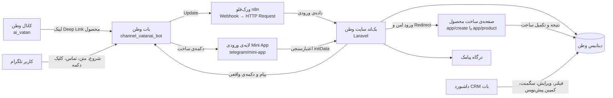

نکته‌ی مهم: `n8n` فقط ورودی تلگرام را دریافت و به سایت منتقل می‌کند. تصمیم‌گیری، ثبت در دیتابیس، ارسال پیام و ساخت دکمه‌ها در بک‌اند انجام می‌شود.

---

## ۳. مسیر کاربر از نگاه خودش

### مسیر A — ورود از لینک محصول در کانال

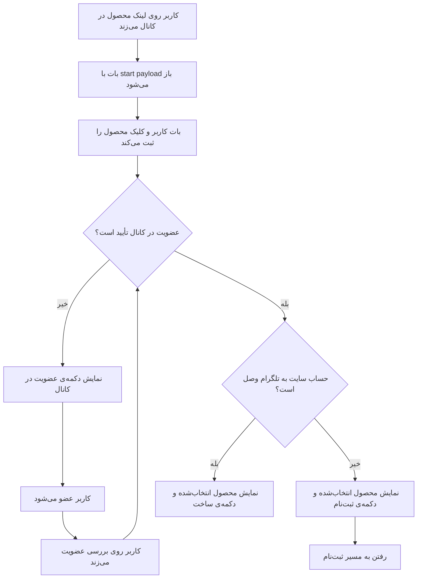

فرمت مفهومی لینک محصول:

```text
https://t.me/channel_vatanai_bot?start=tl_<شناسه‌ی لینک>
```

هر لینک یک رکورد مستقل در `telegram_deep_links` و هر ورود کاربر یک `launch_token` مستقل در `telegram_product_clicks` ایجاد می‌کند.

### مسیر B — ثبت‌نام کاربر جدید

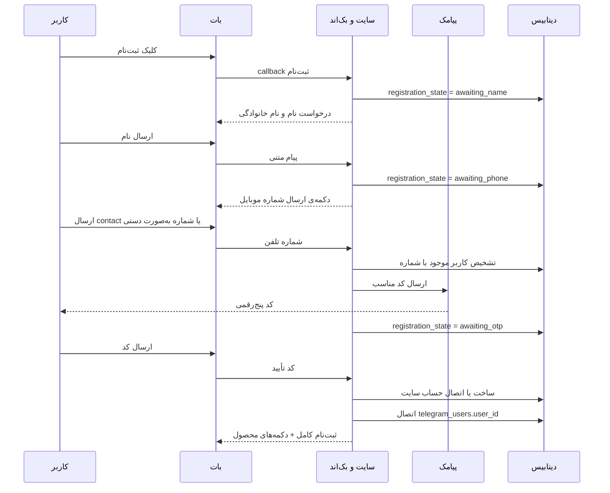

جزئیات ثبت‌نام:

1. اگر شماره در سایت وجود نداشته باشد، حساب سایت ساخته می‌شود و هدیه‌ی ثبت‌نام طبق تنظیمات اعمال می‌شود.
2. اگر شماره قبلاً در سایت وجود داشته باشد، همان حساب به تلگرام وصل می‌شود؛ حساب جدید ساخته نمی‌شود.
3. کاربر موجود پیامک ورود با نام خودش را دریافت می‌کند؛ کاربر جدید پیامک کد ثبت‌نام را دریافت می‌کند.
4. تطبیق با نام، `username` یا حدس‌زدن هویت انجام نمی‌شود؛ معیار اصلی شماره‌ی تأییدشده است.
5. شماره‌ی ارسالی با دکمه فقط وقتی پذیرفته می‌شود که `user_id` تماس با شناسه‌ی کاربر تلگرام یکسان باشد.
6. کد `OTP` سه دقیقه اعتبار دارد، حداکثر پنج تلاش دارد و ارسال مجدد محدود می‌شود.

### مسیر C — کاربر قبلی

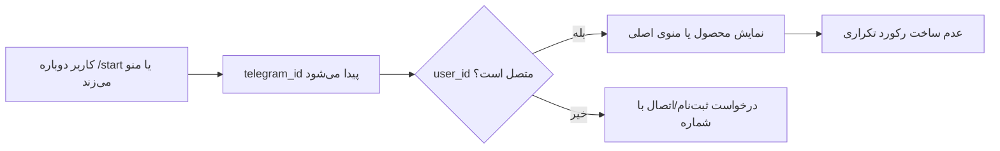

ثبت دوباره‌ی `/start` باعث ساخت کاربر تلگرامی تکراری نمی‌شود؛ فعالیت و آخرین رویداد به‌روزرسانی می‌شود. اگر لینک محصول جدید باشد، کلیک محصول جدید به‌صورت جدا ثبت می‌شود.

### مسیر D — نمایش محصول و ساخت

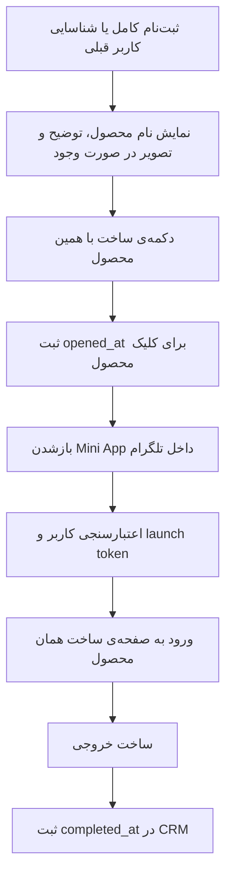

دکمه‌های قابل‌نمایش بعد از شناسایی کاربر:

- `ساخت با همین محصول`: بازکردن همان محصول با `launch_token`.
- `نمایش همه قالب‌ها`: بازکردن فهرست محصولات در `Mini App`.
- `مشاهده و خرید پلن`: بازکردن صفحه‌ی پلن‌ها در `Mini App`.

---

## ۴. مسیر `Mini App` از نگاه کاربر و سرور

آدرس اصلی لایه‌ی ورودی:

```text
https://aivatan.com/telegram/mini-app?all=1
```

این آدرس یک صفحه‌ی واسط بسیار کوتاه است؛ خودش صفحه‌ی ساخت نیست. وظیفه‌اش این است که ابتدا هویت تلگرام را اعتبارسنجی کند و بعد کاربر را به صفحه‌ی درست سایت بفرستد.

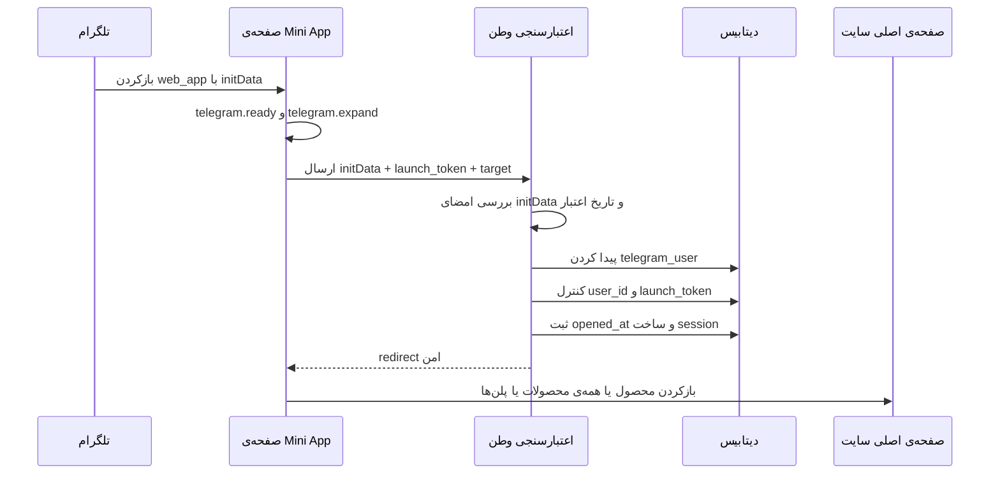

سه مقصد فعلی:

| ورودی | مقصد نهایی |
|---|---|
| `launch_token` محصول | صفحه‌ی ساخت همان محصول |
| `all=1` | صفحه‌ی اصلی اپ و همه‌ی قالب‌ها |
| `target=plans` | صفحه‌ی پلن‌ها و خرید |

اگر کاربر از داخل `Mini App` ثبت‌نام نکرده باشد، سرور پاسخ `TELEGRAM_REGISTRATION_REQUIRED` می‌دهد و صفحه‌ی واسط دکمه‌ی بازگشت به بات برای ثبت‌نام را نشان می‌دهد.

---

## ۵. مسیر فنی هر پیام بات

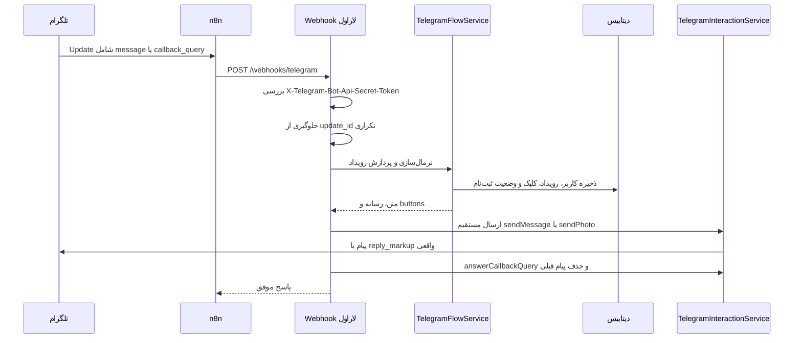

ورک‌فلو فعال `n8n` عمداً ساده است:

```text
Webhook → HTTP Request به https://aivatan.com/webhooks/telegram
```

ارسال مستقیم از بک‌اند باعث می‌شود دکمه‌های پویا، دکمه‌ی `web_app` و دکمه‌ی `request_contact` درست به `Telegram Bot API` برسند و پیام دوبار ارسال نشود.

---

## ۶. نقشه‌ی رویدادها و دکمه‌ها

| رویداد | ورودی کاربر | نتیجه‌ی فعلی |
|---|---|---|
| `start` | ورود از لینک محصول یا `/start` | ثبت کاربر، ثبت منبع و محصول، بررسی عضویت |
| `membership_check` | کلیک بررسی عضویت | استعلام عضویت و ادامه‌ی مسیر |
| `register` | کلیک ثبت‌نام | ورود به مرحله‌ی دریافت نام |
| `message` | نام، شماره‌ی دستی یا کد پیامک | حرکت در ماشین ثبت‌نام |
| `contact` | ارسال شماره با دکمه | اتصال یا ساخت حساب سایت |
| `build` | کلیک ساخت محصول | ساخت `web_app` URL و ثبت `opened_at` |
| `all_products` | نمایش همه‌ی قالب‌ها | بازکردن همه‌ی قالب‌ها در `Mini App` |
| دکمه‌ی پلن | مشاهده و خرید پلن | بازکردن صفحه‌ی پلن‌ها |

دکمه‌ها در پیام تلگرام به این شکل تبدیل می‌شوند:

```text
callback_data → دکمه‌ی شیشه‌ای و callback
url            → لینک معمولی
web_app.url    → بازشدن Mini App داخل تلگرام
request_contact → صفحه‌کلید ارسال شماره موبایل
```

---

## ۷. ماشین وضعیت ثبت‌نام

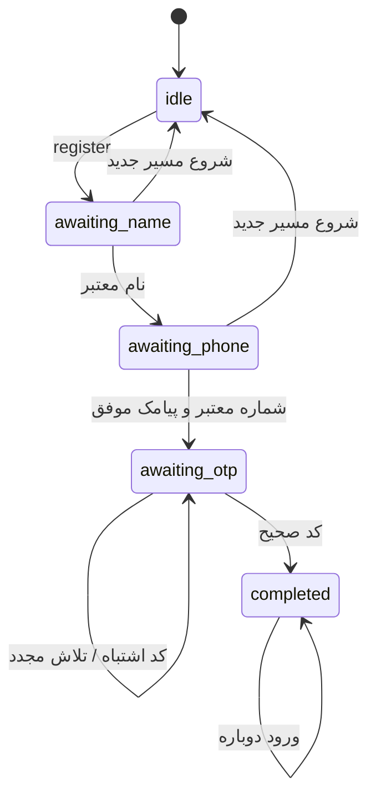

وضعیت در ستون `telegram_users.registration_state` ذخیره می‌شود و داده‌ی موقت نام یا شماره در `registration_payload` نگهداری می‌شود.

---

## ۸. نقشه‌ی دیتابیس

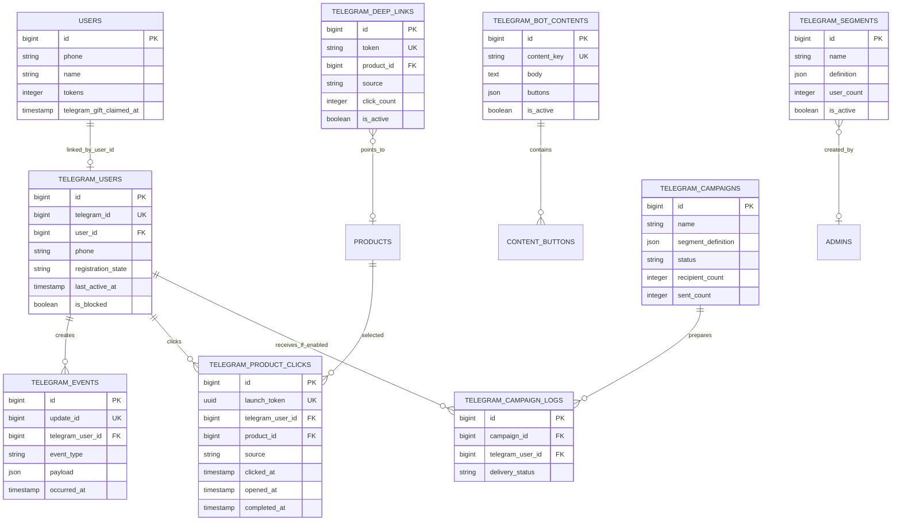

### مهم‌ترین رابطه‌ی محصول تا خروجی

```text
telegram_deep_links.token
        ↓
telegram_product_clicks.launch_token
        ↓
telegram_product_clicks.product_id
        ↓
telegram_product_clicks.opened_at
        ↓
telegram_product_clicks.completed_at
```

این زنجیره در `CRM` جواب می‌دهد که چه کسی از کدام لینک و کدام محصول وارد شده، آیا صفحه را باز کرده و آیا ساخت را کامل کرده است.

---

## ۹. داشبورد `CRM` از نگاه مدیر

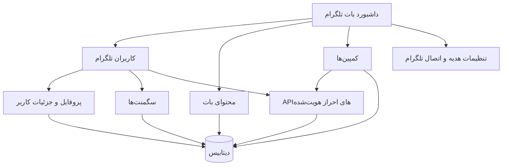

صفحات فعلی:

| صفحه | کاربرد | اتصال فعلی |
|---|---|---|
| `/admin/telegram` | آمار، روند رویدادها، منابع و محصولات | متصل به `telegram_events` و `telegram_product_clicks` |
| `/admin/telegram/users` | فهرست، فیلتر، سگمنت و مدیریت کاربران | متصل به `telegram_users` و رابطه‌ی سایت |
| `/admin/telegram/users/{id}` | جزئیات، مسدودسازی، آرشیو و اعتبار | متصل به کاربر تلگرام و حساب سایت |
| `/admin/telegram/content` | ویرایش متن، متغیرها، رسانه و buttons | متصل به `telegram_bot_contents` |
| `/admin/telegram/campaigns` | ساخت کمپین و آماده‌سازی گیرندگان | متصل به `telegram_campaigns` و logها |
| `/admin/settings/new-user-gift` | تنظیم هدیه و قواعد مرتبط | متصل به تنظیمات و اعتبار کاربر |

APIهای اصلی مدیر:

```text
GET  /api/telegram-users
POST /api/telegram-users
GET  /api/campaigns
POST /api/campaigns
```

تمام این APIها به احراز هویت مدیر نیاز دارند و شماره‌ی تلفن خام را در پاسخ عمومی فهرست کاربران نمایش نمی‌دهند.

### فیلترهای اصلی `CRM`

- کاربر متصل یا غیرمتصل به سایت
- منبع ورود و کمپین
- محصول انتخاب‌شده
- بازه‌ی فعالیت
- استفاده‌کردن یا نکردن از ساخت
- تعداد ساخت‌ها
- ماه تولد کاربر سایت
- کاربر مسدود یا فعال
- تاریخ ایجاد حساب

---

## ۱۰. مسیرهای امنیتی

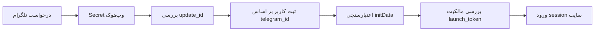

- توکن بات در مرورگر، `Mini App` یا کد سمت کاربر قرار نمی‌گیرد.
- وب‌هوک بدون هدر امن رد می‌شود.
- هر `launch_token` فقط برای همان کاربر تلگرام و مدت محدود معتبر است.
- اتصال سایت و تلگرام با شماره‌ی تأییدشده انجام می‌شود.
- کاربر نمی‌تواند `callback` تماس کاربر دیگری را به‌جای خودش ارسال کند.
- حساب‌های مسدود از پردازش و کمپین‌ها کنار گذاشته می‌شوند.
- رویداد تکراری با `update_id` دوباره پردازش نمی‌شود.

---

## ۱۱. وضعیت قابلیت‌های باقی‌مانده

| قابلیت | وضعیت فعلی | توضیح |
|---|---|---|
| ورود از کانال با محصول | ✅ فعال | `Deep Link` و ثبت منبع/محصول |
| جلوگیری از کاربر تکراری | ✅ فعال | بر اساس `telegram_id` |
| اتصال کاربر سایت و تلگرام | ✅ فعال | با شماره و `OTP` |
| دکمه‌های سریع بات | ✅ فعال | ارسال مستقیم از بک‌اند |
| بازشدن مستقیم `Mini App` | ✅ فعال | از دکمه‌ی `web_app` |
| ساخت با محصول انتخاب‌شده | ✅ فعال | با `launch_token` |
| ثبت بازشدن و تکمیل ساخت | ✅ فعال | `opened_at` و `completed_at` |
| داشبورد و `CRM` | ✅ فعال | کاربران، محتوا، سگمنت و کمپین |
| ارسال کمپین عمومی | 🟡 خاموش | زیرساخت آماده، ارسال نیازمند اجازه‌ی جداگانه |
| تبریک تولد خودکار | 🟡 خاموش | ورک‌فلو آماده ولی غیرفعال |
| ارسال رسانه‌ی محتوای داشبورد با `file_id` | 🟡 نیازمند تکمیل | مسیر اصلی متن و دکمه کامل است؛ رسانه‌ی ذخیره‌شده‌ی داشبورد باید در فرستنده‌ی مستقیم نیز پشتیبانی شود |

---

## ۱۲. چک‌لیست تست پذیرش کاربر

1. از یک لینک واقعی محصول در کانال وارد بات شو.
2. عضویت کانال را بررسی کن.
3. با کاربر جدید نام، شماره و کد پیامک را وارد کن.
4. مطمئن شو محصول همان محصول لینک‌شده نمایش داده می‌شود.
5. روی `ساخت با همین محصول` بزن.
6. بررسی کن سایت داخل تلگرام باز شود و مستقیم به همان محصول برود.
7. یک ساخت آزمایشی انجام بده.
8. با `/start` دوباره برگرد و مطمئن شو ثبت‌نام تکراری ساخته نمی‌شود.
9. از `نمایش همه قالب‌ها` و `مشاهده و خرید پلن` مقصد درست را بررسی کن.
10. در داشبورد، کاربر، منبع، محصول، بازشدن و تکمیل ساخت را بررسی کن.

### نتیجه‌ی مورد انتظار

```text
یک کلیک در کانال
→ یک کاربر یکتا در telegram_users
→ یک کلیک با launch_token
→ یک حساب سایت متصل
→ یک Mini App معتبر
→ یک محصول درست
→ یک رکورد تکمیل‌شده در CRM
```

